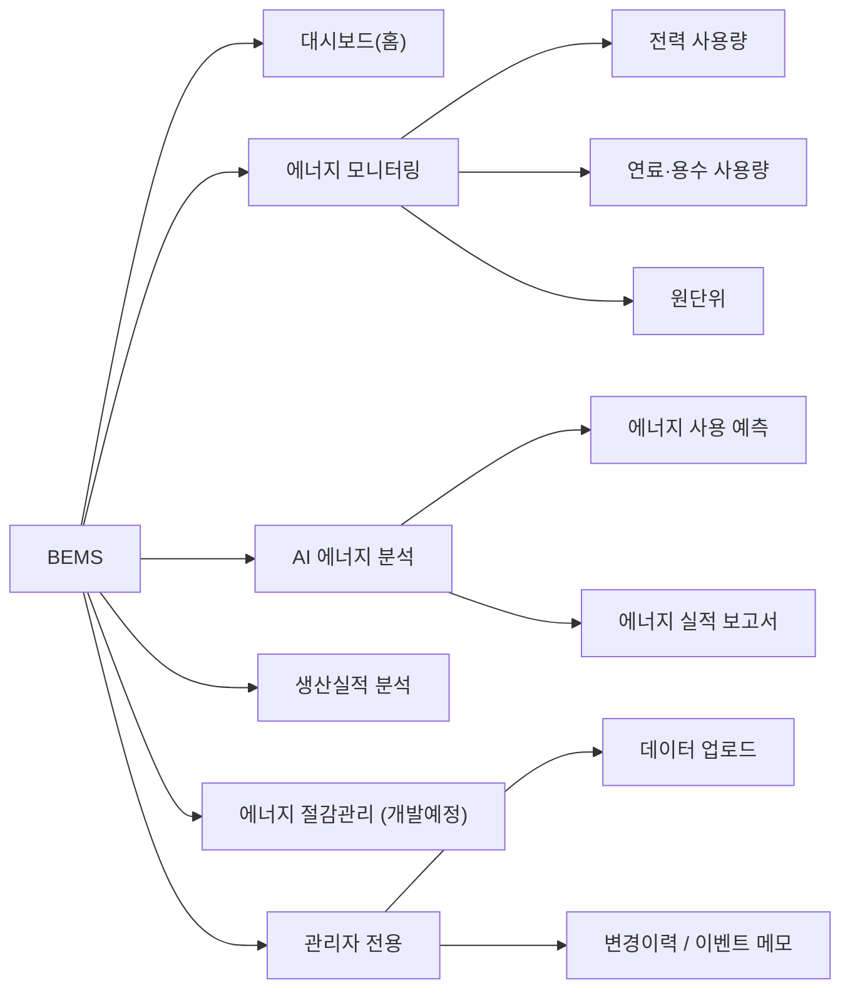

# BEMS 기능 설명서 — 임원진용

> **BEMS** = Binggrae Energy Management System  
> 전사 에너지(전력·연료·용수·폐수) 및 생산실적 데이터를 실시간으로 통합·분석하는 웹 대시보드입니다.

---

## 📌 시스템 전체 구조 (사이드바 메뉴 기준)

---

## 1. 대시보드 (홈)

> **한 줄 요약**: 경영진이 매일 아침 한 화면에서 에너지 이상 여부, 최근 추이, 전년비 성과를 즉시 파악하는 **종합 현황판**입니다.

### 1-1. AI 이상감지 알림 배너

| 항목 | 설명 |
|------|------|
| **기능** | AI 예측 모델이 산출한 예상 에너지 사용량과 실제 사용량을 비교하여, 오차율이 임계값(20%) 이상인 항목을 자동으로 감지합니다. |
| **표시 내용** | 정상(✅ 녹색) 또는 이상감지(🚨 빨간색) 배너로 최근 7일간 상태를 보여줍니다. |
| **활용법** | 이상 감지 시 "🔍 분석" 버튼을 누르면 AI(LLM)가 해당 이상의 **가능한 원인 가설과 점검 우선순위**를 자동 진단합니다. 실무자는 진단 결과 아래 **이벤트 메모**에 실제 원인과 조치사항을 기록할 수 있습니다. |
| **경영 가치** | "왜 에너지가 급등했나?"라는 질문에 AI가 1차 답변을 제시하고, 실무자 기록이 축적되면 향후 동일 패턴 발생 시 즉시 대응 가능합니다. |

### 1-2. 7일간 생산량 · 원단위 추이

| 항목 | 설명 |
|------|------|
| **기능** | 최근 7일간의 일별 생산량(좌축)과 에너지 원단위(우축)를 4분면(전력/연료/용수/폐수) 차트로 동시 표시합니다. |
| **필터** | 사업장(전사·남양주1·남양주2·김해·광주·논산)을 라디오 버튼으로 전환하여 즉시 비교할 수 있습니다. |
| **활용법** | 생산량이 늘었는데 원단위도 함께 올라가면 → 설비 효율 저하 의심. 생산량이 줄었는데 원단위가 급등하면 → 고정 에너지(대기전력 등) 비중 과다. |
| **CSV 다운로드** | 현재 화면 데이터를 CSV로 내려받아 보고서·PPT 작성에 바로 활용할 수 있습니다. |

### 1-3. 월간 원단위/사용량/생산량 전년비

| 항목 | 설명 |
|------|------|
| **기능** | 선택한 연·월의 에너지 실적을 전년 동월과 비교하는 막대 차트입니다. |
| **지표 구분** | "원단위" / "사용량" / "생산량" 세 가지 모드를 선택할 수 있어 관점을 전환할 수 있습니다. |
| **색상 규칙** | 전년 대비 **개선(절감)은 파란색**, **악화(증가)는 빨간색**으로 표시되어 한눈에 성과를 판단할 수 있습니다. |
| **활용법** | 월례 경영회의에서 "전년 대비 에너지 효율이 얼마나 개선/악화되었는가?"를 이 차트 하나로 보고할 수 있습니다. |

---

## 2. 에너지 모니터링

> **한 줄 요약**: 전력·연료·용수를 항목별로 **심층 드릴다운** 분석할 수 있는 전문 분석 화면입니다.

### 2-1. 전력 사용량 ⚡

| 섹션 | 기능 | 활용법 |
|------|------|--------|
| **일별 추이 비교** | 선택한 월의 일별 전력 사용량을 전체/냉동/공압기/기타로 분리하여 라인 차트로 표시합니다. | 냉동기나 공압기의 전력 점유율이 비정상적으로 높은 날을 찾아 설비 점검 시점을 결정합니다. |
| **기간별 추이 비교** | 시작일~종료일을 자유롭게 지정하여 같은 형태의 차트를 확인합니다. | 특정 프로젝트나 시운전 기간의 전력 영향을 분석할 때 사용합니다. |
| **전년대비 분석** | 금년 vs 전년의 월별 전력 사용량을 라인+테이블로 비교합니다. 누계 행 포함. | 연간 전력 절감 목표 대비 진행 상황을 월별로 추적합니다. |

### 2-2. 연료·용수 사용량 🔥💧

| 섹션 | 기능 | 활용법 |
|------|------|--------|
| **일별 사용량 비교** | 연료(Nm³)와 용수/폐수(ton)를 좌우 분할 차트로 일별 표시합니다. KPI 카드에 원단위도 함께 표시됩니다. | 보일러 가동률과 연료 사용량의 상관관계를 일 단위로 확인합니다. |
| **기간별 사용량 비교** | 자유 기간을 지정하여 공장별 연료/용수/폐수 추이를 비교합니다. | 계절별(여름 냉각수, 겨울 보일러) 사용 패턴을 분석합니다. |
| **전년대비 분석** | 연료/용수/폐수 중 하나를 선택하여 전년 동월 비교 + 월별 증감률 테이블을 확인합니다. | 용수 절감 활동의 효과를 수치로 검증합니다. |
| **공장별 폐수 비율** | 공장별로 용수 투입량 대비 폐수 배출 비율(%)을 막대 + 테이블로 표시합니다. | 폐수 처리 효율이 낮은 공장을 식별하여 환경 투자 우선순위를 결정합니다. |

### 2-3. 원단위 📊

| 항목 | 설명 |
|------|------|
| **원단위란?** | `에너지 사용량 ÷ 생산량(ton)` = 1톤을 만드는 데 드는 에너지. **낮을수록 효율적**입니다. |
| **지표 선택** | 전력(kWh/ton), 연료(Nm³/ton), 용수(ton/ton), 폐수(ton/ton) 중 선택합니다. |
| **일별 / 기간별 추이** | 공장별 원단위 추이를 시각화하여 어느 공장이 효율이 좋은지/나쁜지 비교합니다. |
| **전년대비 원단위** | 전년 대비 원단위가 개선되었는지를 월별로 추적합니다. 누계는 단순 평균이 아닌 **가중 평균**(Σ사용량 ÷ Σ생산량)으로 정확히 계산됩니다. |
| **활용법** | "같은 양을 만들 때 에너지를 얼마나 덜 쓰고 있는가?"라는 **에너지 효율의 핵심 지표**입니다. |

---

## 3. AI 에너지 분석

> **한 줄 요약**: 머신러닝 모델이 에너지 사용량을 **예측**하고, AI가 경영진용 **분석 보고서**를 자동 작성합니다.

### 3-1. 에너지 사용 예측 🤖

| 섹션 | 기능 | 활용법 |
|------|------|--------|
| **예측 조건** | 공장·시작일·종료일을 선택합니다. "전체" 선택 시 5개 실공장을 순차 예측합니다. | 내일~다음 주 에너지 수요를 미리 파악하여 구매/운영 계획을 세울 수 있습니다. |
| **입력 데이터 편집** | 예측에 사용되는 생산량·기온 등 입력값을 직접 수정할 수 있습니다. 엑셀 복붙도 지원됩니다. | "생산량을 20% 늘리면 전력이 얼마나 더 필요한가?"라는 시나리오 분석이 가능합니다. |
| **예측 결과** | 날짜·항목(전력/연료/용수)별 예측값과 실측값(있는 경우)을 테이블 + 차트로 표시합니다. | 예측 오차가 큰 날은 설비 이상이나 비정상 운전이 있었을 가능성이 높습니다. |
| **모델 변수 영향도** | AI 모델이 어떤 변수(기온·습도·생산량 등)에 가장 크게 의존하는지 Top 5를 한국어로 설명합니다. | "이 예측은 왜 이런 값이 나왔나?"에 대한 투명한 설명을 제공합니다. |
| **예측 이력 조회** | 과거에 실행한 예측 결과와 실측 대비 오차율(MAPE)을 확인합니다. | 모델 정확도를 지속 모니터링하여 재학습 시점을 판단합니다. |
| **모델 재학습** | (관리자) 새로운 데이터가 축적되면 수동으로 재학습을 트리거합니다. | 계절 변화나 설비 교체 후 모델 정확도가 떨어질 때 갱신합니다. |

### 3-2. 에너지 실적 보고서 📄

| 항목 | 설명 |
|------|------|
| **기능** | AI(OpenAI GPT)가 DB에서 직접 데이터를 조회하여 경영진용 에너지 실적 분석 리포트를 자동 생성합니다. |
| **생성 조건** | 분석 대상(전사 또는 개별 공장), 기준 연·월을 선택합니다. |
| **보고서 내용** | Key Highlights, 상세 분석(전력·연료·용수), 전년비 비교, 리스크 및 제언을 포함한 Markdown 형식 보고서입니다. |
| **저장 및 재생성** | 생성된 보고서는 DB에 저장되어 언제든 다시 열람 가능합니다. 재생성(덮어쓰기)도 가능합니다. |
| **활용법** | 매월 에너지 현황을 파악하기 위한 보고서를 5분 내에 자동 생성할 수 있어, 수작업 보고서 작성 부담을 크게 줄입니다. |

---

## 4. 생산실적 분석 🏭

> **한 줄 요약**: 공장별·제품유형별 생산 계획 대비 실적을 추적하고, 에너지 사용과의 연관 관계를 분석합니다.

| 섹션 | 기능 | 활용법 |
|------|------|--------|
| **조회 조건** | 연·월·공장·보관유형(냉동/냉장/상온)·제품유형(IC/MY/FM/SN)을 다중 필터로 선택합니다. | 특정 제품군의 실적만 집중 분석할 때 사용합니다. |
| **요약 KPI** | 누계 계획·실적·진척률(%)·품목 수를 카드로 표시합니다. | 월중 진행률을 한눈에 확인하여 잔여 일정의 가속 필요 여부를 판단합니다. |
| **제품유형별 비중** | 제품유형별 생산 실적/계획 비중을 도넛 차트로 표시합니다. | 주력 제품군의 계획 대비 실적 괴리를 시각적으로 파악합니다. |
| **일별 생산량 추이** | 일별 생산량을 제품유형별 라인 차트로 표시합니다. | 특정 일자의 생산 감소 원인(설비 정비, 원자재 부족 등)을 추적합니다. |
| **Top 10 품목** | 누계 실적 기준 상위 10개 품목의 계획 vs 실적을 비교합니다. | 핵심 품목의 목표 달성 여부를 점검합니다. |
| **에너지 믹스 ↔ 생산실적 보정** | 믹스생산량 = **자사 완제품 + 판매용 반제품(WIP)**. 판매용 WIP 는 광주공장만 존재하며, MIS 유틸리티 raw data 에 자동 합산되지 않아 MIS 재공품 화면에서 추출 후 **환산계수를 적용해 자동 합산**합니다 (7품목: `260014 탈지분유` ×10.91954, `260042 유크림믹스` ×4 등). | 광주는 이 보정 없이는 판매용 WIP 가 분모에서 빠져 원단위가 비정상으로 보임 — 보정 후 자사 완제품과 동일 기준으로 비교 가능. |
| **에너지 vs 생산량** | 일별 생산량(막대)과 전력 사용량(라인)을 중첩 차트로 비교합니다. | 생산량 변동과 에너지 사용의 동조 여부를 확인합니다. |
| **월별 누계 추이** | 최근 6개월간 제품유형별 누계 실적 추이를 확인합니다. | 중장기 생산 트렌드를 파악합니다. |
| **What-if 시뮬레이터** | 특정 카테고리의 생산량을 증감시켰을 때 에너지 변동량을 회귀 계수 기반으로 추정합니다. | "아이스크림 10만kg 증산하면 전력이 얼마나 더 필요한가?"에 대한 사전 시뮬레이션이 가능합니다. |

---

## 5. 에너지 절감관리 (개발 예정)

| 항목 | 설명 |
|------|------|
| **절감 계획 관리** | 연간·분기별 에너지 절감 목표 설정, 공장별 절감 계획 수립·추적, 시나리오 시뮬레이션 등이 구현될 예정입니다. |
| **절감 실적 현황** | 절감 계획 대비 실적 대시보드, 월별·분기별 리포트, 공장별 절감 랭킹, ROI 분석 등이 구현될 예정입니다. |

---

## 6. 관리자 전용 기능

> 아래 기능은 **관리자(호스트 PC)** 계정에서만 접근 가능합니다.

### 6-1. 데이터 업로드 📤

| 항목 | 설명 |
|------|------|
| **자동 동기화** | 원본 엑셀 파일(`RawDB_일일 원단위.xlsx`)이 변경되면 앱 시작 시 자동으로 DB에 반영됩니다. 수동 "지금 동기화" 버튼도 있습니다. |
| **수동 업로드** | 엑셀 파일(.xlsx/.xls)을 직접 업로드합니다. 시트명이 공장 코드(남양주1·김해 등)여야 합니다. |
| **UPSERT** | 동일 (공장+날짜) 데이터가 이미 존재하면 자동으로 덮어쓰기(UPSERT)되고, 변경 이력이 기록됩니다. |
| **업로드 이력** | 누가 언제 어떤 파일을 업로드했는지 이력을 확인할 수 있습니다. |

### 6-2. 변경이력 / 이벤트 메모 📝

| 탭 | 기능 | 활용법 |
|----|------|--------|
| **변경 이력** | 데이터의 모든 변경 사항(업로드·수동편집·자동동기화 등)을 추적합니다. 누가(변경자)·언제·어떤 컬럼을·이전값→변경값으로 수정했는지 상세 기록됩니다. | 데이터 신뢰성 확보 및 감사(Audit) 대응에 활용합니다. |
| **이벤트 메모** | 실무자가 차트 이상치(스파이크)에 대해 원인·조치사항을 기록하는 로그입니다. 태그(센서고장·설비정비 등)와 중요도(info/warn/critical)를 분류합니다. | "그때 왜 그랬어?"라는 질문에 즉시 답할 수 있는 **조직 기억**을 축적합니다. |

---

## 🔑 핵심 용어 정리

| 용어 | 의미 |
|------|------|
| **원단위 (Intensity)** | 에너지 사용량 ÷ 생산량(ton). 예: 전력 원단위 100 kWh/ton = 1톤 생산에 전력 100kWh 소비. **낮을수록 효율적**. |
| **MAPE** | 평균 절대 백분율 오차. AI 예측 정확도 지표로 **낮을수록 정확**합니다. |
| **전년비 (YoY)** | Year-over-Year. 금년 실적을 전년 동월과 비교한 증감률입니다. |
| **UPSERT** | 기존 데이터가 있으면 갱신(Update), 없으면 삽입(Insert)하는 방식입니다. |
| **믹스 생산량** | 공장 일일 생산량 집계(`mix_prod_kg`) = **자사 완제품 + 판매용 반제품(WIP)**. 판매용 WIP 는 광주공장만 존재하며, MIS 유틸리티 raw data 에 자동 합산되지 않아 환산계수를 적용해 자동 합산합니다. (병 등 다른 재공품은 분모 합산이 아니라 AI 예측 모델 피처로만 사용) |

---

## 💡 자주 묻는 질문 (FAQ)

**Q1. 원단위가 올라갔다고 무조건 나쁜 건가요?**  
→ 생산량이 크게 줄었을 때 고정 에너지(조명·대기전력·보일러 예열 등)의 비중이 커져서 원단위가 일시 상승할 수 있습니다. **생산량 변동과 함께** 봐야 정확한 판단이 가능합니다.

**Q2. AI 예측은 얼마나 정확한가요?**  
→ 현재 모델의 평균 MAPE는 약 3~6% 수준입니다. 예측 이력 페이지에서 항목별·공장별 정확도를 실시간으로 확인할 수 있습니다.

**Q3. 외부(사무실 PC)에서도 접속 가능한가요?**  
→ 같은 네트워크 내에서 접속 가능합니다. 호스트 PC에서 접속하면 관리자(root) 권한, 외부 PC에서는 조회 전용(viewer) 권한이 자동 부여됩니다.

**Q4. 데이터는 실시간인가요?**  
→ 일일 에너지 데이터는 원본 엑셀이 갱신될 때 앱 시작 시 자동 동기화됩니다. 생산실적도 마찬가지입니다. 실시간(분 단위)은 아니며 **일 단위** 갱신입니다.

**Q5. 보고서를 PDF로 받을 수 있나요?**  
→ 현재는 웹 화면에서 확인 가능하며, 브라우저의 인쇄(Ctrl+P → PDF 저장) 기능을 활용하시면 됩니다. CSV 다운로드는 대시보드와 전년비 섹션에서 지원됩니다.
