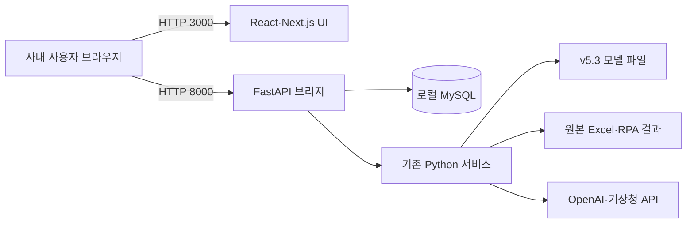
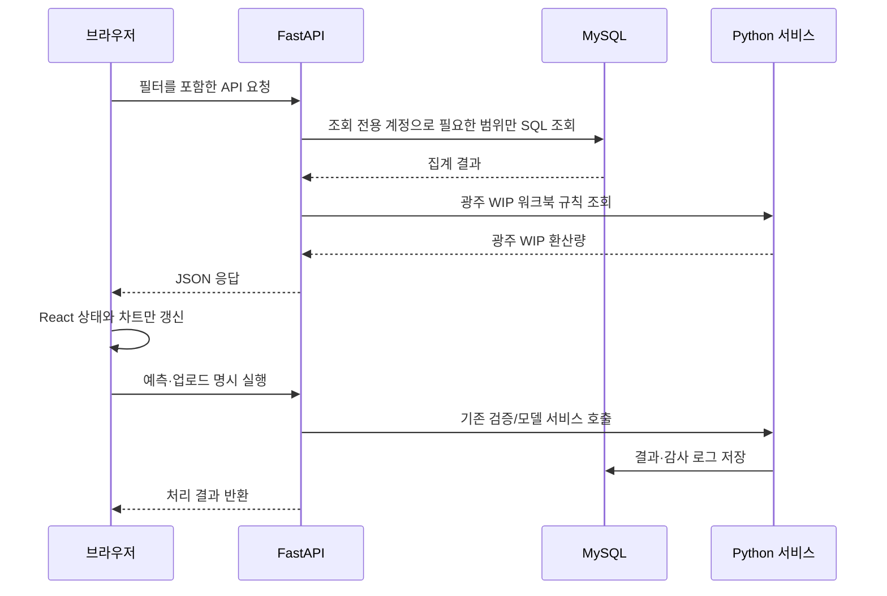

# AI Elite BEMS Next 시스템 아키텍처

## 1. 권장 운영 구성

프런트엔드와 API는 같은 서버 PC에서 실행하지만 프로세스를 분리합니다. 화면 렌더링 지연이 DB 조회나 모델 계산과 섞이지 않고, 한 사용자의 화면 조작이 다른 사용자 세션을 다시 실행시키지 않습니다.

실제 서버 오픈·방화벽·사내망 접속·종료 절차는 [RUN_GUIDE_KR.md](../RUN_GUIDE_KR.md)를 기준으로 운영한다.

## 2. 계층별 역할

| 계층 | 기술 | 책임 |
|---|---|---|
| UI | React 19, Next.js 15, Recharts | 화면 상태, 필터, 차트, 반응형 UI |
| API | FastAPI, Uvicorn | 요청 검증, 권한 판정, JSON 변환, 기존 서비스 호출 |
| 업무 로직 | 기존 Python `app/services` | 예측, 보고서, 업로드, 동기화, 감사 규칙 |
| 저장소 | 서버 PC의 MySQL·Excel·모델 파일 | 원본과 운영 데이터 영속화 |
| 네트워크 | 사내 LAN, Windows 방화벽 | PC 이름 기반 고정 링크와 접근 범위 제한 |

## 3. 권한 구조

브라우저는 FastAPI의 8000 포트에 직접 요청합니다. 따라서 API가 보는 클라이언트 IP는 실제 사용자 PC 주소입니다.

- 서버 PC의 loopback/자기 IP: `admin`
- `BEMS_ADMIN_IPS`에 명시된 주소: `admin`
- 그 외 사내 PC: `viewer`

프런트엔드에서 버튼을 숨기는 것만으로 끝내지 않고, 업로드와 AI 보고서 생성 같은 쓰기 API에서도 관리자 여부를 다시 검사합니다.
감사 로그 조회와 예측 실행도 관리자 전용입니다. 브라우저가 Origin을 보내는 쓰기·삭제
요청은 서버 호스트·LAN IP의 기본 목록 또는 `BEMS_ALLOWED_ORIGINS`에 추가한 정확한
Origin만 허용합니다. Origin이 없는 비브라우저 요청도 별도의 관리자 IP 검사를 통과해야 합니다.

## 4. 데이터 흐름

## 5. Sites 배포와 실제 운영의 차이

Sites에 배포된 화면은 사용자의 서버 PC 안에 있는 MySQL에 직접 연결할 수 없습니다. 브라우저 보안과 사내 방화벽을 우회해서도 안 됩니다. 따라서:

- Sites/개발 미리보기: 화면 검토용 예시 데이터 사용, 본문에 demo 경고 표시
- 사내 운영: `RUN_BEMS_NEXT.bat`로 서버 PC에서 UI와 API를 함께 실행

운영자는 [RUN_GUIDE_KR.md](../RUN_GUIDE_KR.md)의 최초 설치, `:3000` 웹 접속, `:8000` 상태 점검과 admin/viewer 확인 절차를 따른다.

클라우드에서 실데이터를 보려면 회사가 승인한 VPN, Zero Trust 터널, 사내 리버스 프록시 같은 별도 인프라가 필요합니다. 이번 구조에는 의도적으로 포함하지 않았습니다.

## 6. 성능·안정성 포인트

- Streamlit 전체 rerun 제거: 페이지 전환과 필터 변경은 필요한 API만 호출
- 프런트 렌더링 분리: React가 브라우저에서 상호작용 처리
- DB 범위 제한: 기간·공장 조건이 포함된 parameterized SQL 사용
- 모델 재사용: 기존 `.pkl`과 레지스트리를 그대로 호출해 결과 불일치 위험 감소
- 프로세스 격리: UI 오류가 모델·DB 프로세스를 직접 종료시키지 않음
- API 키 비노출: 모든 비밀값은 Python 서버에서만 읽음
- legacy 읽기 전용: Python 요구사항은 `new/.venv`에 설치하고 core import의 bytecode 생성 금지
