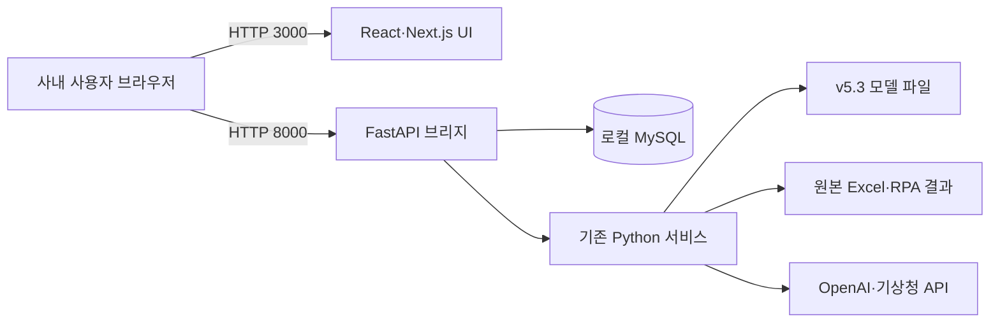
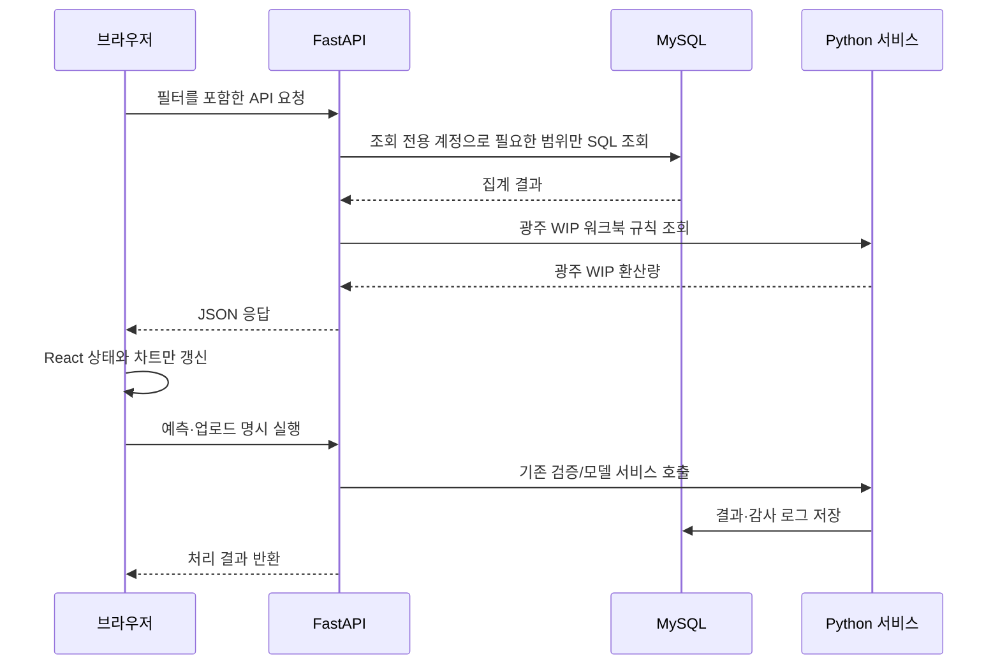

# AI Elite BEMS Next 시스템 아키텍처

## 1. 권장 운영 구성

```mermaid
flowchart LR
    U[사내 사용자 브라우저] -->|HTTP 3000| W[React·Next.js UI]
    U -->|HTTP 8000| A[FastAPI 브리지]
    A --> D[(로컬 MySQL)]
    A --> S[기존 Python 서비스]
    S --> M[v5.3 모델 파일]
    S --> X[원본 Excel·RPA 결과]
    S --> L[OpenAI·기상청 API]
```

프런트엔드와 API는 같은 서버 PC에서 실행하지만 프로세스를 분리합니다. 화면 렌더링 지연이 DB 조회나 모델 계산과 섞이지 않고, 한 사용자의 화면 조작이 다른 사용자 세션을 다시 실행시키지 않습니다.

실제 서버 오픈·방화벽·사내망 접속·종료 절차는 [RUN_GUIDE_KR.md](../RUN_GUIDE_KR.md)를 기준으로 운영한다.

## 2. 계층별 역할

| 계층 | 기술 | 책임 |
|---|---|---|
| UI | React 19, Next.js 15, Recharts | 화면 상태, 필터, 차트, 반응형 UI |
| API | FastAPI, Uvicorn | 요청 검증, 권한 판정, JSON 변환, 기존 서비스 호출 |
| 업무 로직 | 기존 Python `app/services` | 예측, 보고서, 업로드, 동기화, 감사 규칙 |
| 저장소 | 서버 PC의 MySQL·Excel·모델 파일 | 원본과 운영 데이터 영속화 |
| 네트워크 | 사내 LAN, Windows 방화벽 | PC 이름 기반 고정 링크와 접근 범위 제한 |

## 3. 권한 구조

브라우저는 FastAPI의 8000 포트에 직접 요청합니다. 따라서 API가 보는 클라이언트 IP는 실제 사용자 PC 주소입니다.

- 서버 PC의 loopback/자기 IP: `admin`
- `BEMS_ADMIN_IPS`에 명시된 주소: `admin`
- 그 외 사내 PC: `viewer`

프런트엔드에서 버튼을 숨기는 것만으로 끝내지 않고, 업로드와 AI 보고서 생성 같은 쓰기 API에서도 관리자 여부를 다시 검사합니다.
감사 로그 조회와 예측 실행도 관리자 전용입니다. 브라우저가 Origin을 보내는 쓰기·삭제
요청은 서버 호스트·LAN IP의 기본 목록 또는 `BEMS_ALLOWED_ORIGINS`에 추가한 정확한
Origin만 허용합니다. Origin이 없는 비브라우저 요청도 별도의 관리자 IP 검사를 통과해야 합니다.

## 4. 데이터 흐름

```mermaid
sequenceDiagram
    participant B as 브라우저
    participant F as FastAPI
    participant D as MySQL
    participant P as Python 서비스
    B->>F: 필터를 포함한 API 요청
    F->>D: 조회 전용 계정으로 필요한 범위만 SQL 조회
    D-->>F: 집계 결과
    F->>P: 광주 WIP 워크북 규칙 조회
    P-->>F: 광주 WIP 환산량
    F-->>B: JSON 응답
    B->>B: React 상태와 차트만 갱신
    B->>F: 예측·업로드 명시 실행
    F->>P: 기존 검증/모델 서비스 호출
    P->>D: 결과·감사 로그 저장
    F-->>B: 처리 결과 반환
```

## 5. Sites 배포와 실제 운영의 차이

Sites에 배포된 화면은 사용자의 서버 PC 안에 있는 MySQL에 직접 연결할 수 없습니다. 브라우저 보안과 사내 방화벽을 우회해서도 안 됩니다. 따라서:

- Sites/개발 미리보기: 화면 검토용 예시 데이터 사용, 본문에 demo 경고 표시
- 사내 운영: `RUN_BEMS_NEXT.bat`로 서버 PC에서 UI와 API를 함께 실행

운영자는 [RUN_GUIDE_KR.md](../RUN_GUIDE_KR.md)의 최초 설치, `:3000` 웹 접속, `:8000` 상태 점검과 admin/viewer 확인 절차를 따른다.

클라우드에서 실데이터를 보려면 회사가 승인한 VPN, Zero Trust 터널, 사내 리버스 프록시 같은 별도 인프라가 필요합니다. 이번 구조에는 의도적으로 포함하지 않았습니다.

## 6. 성능·안정성 포인트

- Streamlit 전체 rerun 제거: 페이지 전환과 필터 변경은 필요한 API만 호출
- 프런트 렌더링 분리: React가 브라우저에서 상호작용 처리
- DB 범위 제한: 기간·공장 조건이 포함된 parameterized SQL 사용
- 모델 재사용: 기존 `.pkl`과 레지스트리를 그대로 호출해 결과 불일치 위험 감소
- 프로세스 격리: UI 오류가 모델·DB 프로세스를 직접 종료시키지 않음
- API 키 비노출: 모든 비밀값은 Python 서버에서만 읽음
- legacy 읽기 전용: Python 요구사항은 `new/.venv`에 설치하고 core import의 bytecode 생성 금지

## 7. 이용 현황 집계

사내망 이용 수준을 운영 지표로 남기기 위해 일별 접속자 수를 집계합니다.

**어디서 세는가.** `GET /api/v1/session` 한 곳입니다. 이 엔드포인트는 프런트(`BemsApp`)가
화면 진입 시 1회 호출하므로 "사람이 화면을 열었다"에 가장 가깝습니다. 모든 요청에
미들웨어를 거는 방식은 필터 조작 한 번이 만드는 다수의 데이터 요청까지 접속으로
세어버려 채택하지 않았습니다.

**무엇으로 식별하는가.** PC 이름입니다. 배포 주소부터 IP 대신 호스트명을 쓰고 있어,
운영자가 "누가 쓰는지" 확인할 때 보는 값과 집계에 남는 값이 같아야 읽힙니다.
서버는 요청에서 IP만 볼 수 있으므로 역방향 조회(`socket.gethostbyaddr`)로 호스트명을
얻습니다.

- FQDN은 첫 라벨만 남기고 대문자로 맞춥니다 — `BPN123456.corp.local`과 `BPN123456`이
  서로 다른 PC로 세어지면 접속자 수가 부풀려집니다.
- 이름을 얻지 못하면 IP 문자열을 그대로 식별자로 씁니다. 이름이 없다고 접속을
  누락시키는 쪽이 더 나쁩니다. 원본 IP는 `client_ip`에 따로 남겨 대조할 수 있습니다.
- 조회 결과는 프로세스 수명 동안 캐시합니다(실패도 캐시). 역방향 조회는 블로킹
  호출이라, 캐시가 없으면 세션 응답이 DNS 응답 시간만큼 느려집니다.

| 테이블 | 단위 | 비고 |
| --- | --- | --- |
| `access_visit` | (일자, PC) | 같은 PC의 재방문은 `hit_count`만 증가 |
| `access_daily` | 일자 | 화면·CSV가 읽는 단일 출처 |

롤업은 기록할 때마다 상세에서 다시 계산하므로 두 표가 어긋나지 않습니다.

**출처 구분.** 두 표 모두 `source`로 그 행이 어디서 왔는지를 남깁니다.

| source | 의미 |
| --- | --- |
| `live` | 실제 요청을 받아 적재한 실측 집계. `client_ip`가 채워집니다 |
| `backfill` | 접속 로깅 도입(2026-09) 이전 구간을 `backend/tools/backfill_access_daily.py`(실행기: 루트의 `RUN_ACCESS_BACKFILL.bat`)로 채운 값. `client_ip`는 NULL입니다 |

`backfill` 행은 실측이 아닙니다. 두 값이 한 덩어리로 보이면 안 되므로 API 응답
(`GET /api/v1/stats/access`)과 관리자 화면(차트 색·범례·표), CSV의 "출처" 열까지
구분을 그대로 유지합니다. 표시만을 위한 값이 아니라 **두 적재 경로가 서로를 덮어쓰지
않게 하는 안전장치**이기도 합니다 — 백필 스크립트는 이미 기록이 있는 일자를 통째로
건너뜁니다(`--overwrite`로만 해제되며, 이때는 그 일자의 상세를 먼저 지우고 다시
씁니다. 남겨두면 이번에 넣지 않은 PC가 살아남아 접속자 수가 실제보다 많아집니다).

**조회.** `GET /api/v1/stats/access?from=&to=`는 관리자 전용이며, 기본 구간은 오늘 포함
최근 90일입니다. 일자별 집계(`days`), PC별 집계(`clients`), 요약(`summary`)을 함께
돌려줍니다. 관리자 메뉴의 "접속 통계" 탭이 이 API를 사용합니다.

**집계 실패는 서비스를 막지 않습니다.** 기록 경로의 예외는 서비스 계층에서 삼키고
경고 로그만 남깁니다 — 이용 통계 때문에 권한 판정이 실패하면 화면 전체가 멈춥니다.

**개인정보 관점.** PC 이름은 IP보다 개인을 특정하기 쉽습니다. 이 집계는 회사 자산인
사내 PC의 사내 시스템 이용 현황이라는 전제에서 운영하며, 접속 사실(일자·횟수) 외에
어떤 화면을 봤는지는 남기지 않습니다.
