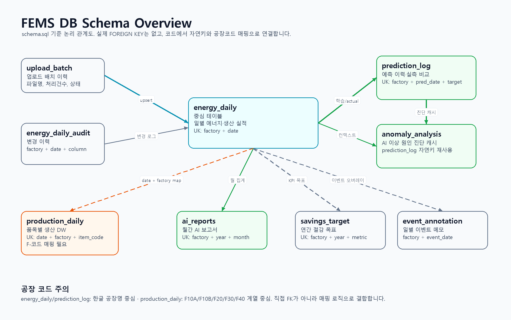
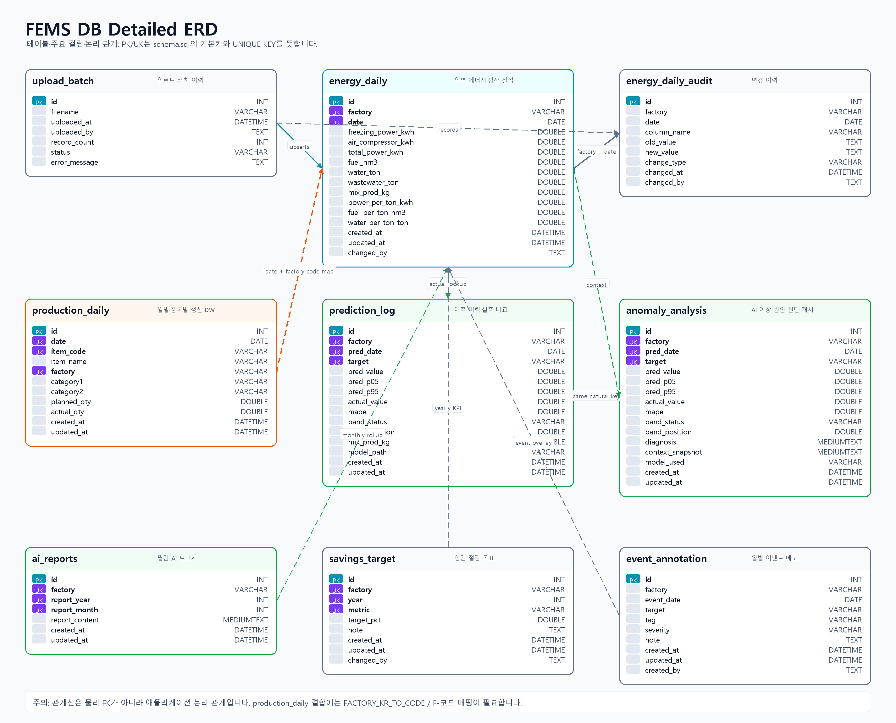
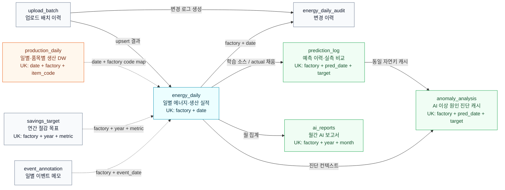
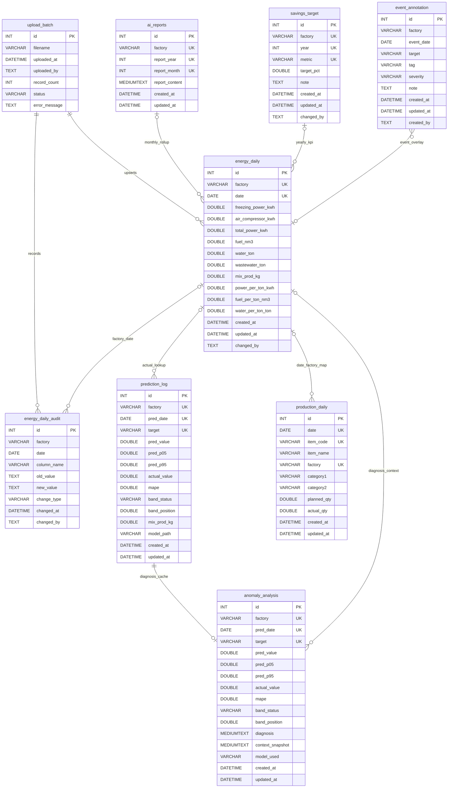

# DB 다이어그램

기준 파일: `app/database/schema.sql`

## 이미지

주의: 현재 스키마에는 `FOREIGN KEY` 제약이 정의되어 있지 않습니다. 아래 선은 코드에서 사용하는 논리 관계입니다. 특히 `production_daily`는 생산 DW 기준 F-코드(`F10A`, `F10B`, `F20`, `F30`, `F40`)를 중심으로 쓰이고, `energy_daily`, `prediction_log` 등은 한글 공장명을 중심으로 쓰므로 조인 시 공장 코드 매핑이 필요합니다.

## 한눈에 보는 구조

## 상세 ERD

## 읽는 법

- `energy_daily`가 중심 테이블입니다. 공장별 일자 단위의 에너지 사용량, 생산량, 원단위를 보관합니다.
- `production_daily`는 품목 단위 생산실적입니다. 같은 일자·공장 기준으로 `energy_daily`와 분석에 결합되지만, 공장 코드 체계가 달라 매핑 로직을 거칩니다.
- `prediction_log`는 예측값과 실제값 비교 결과를 저장하고, `anomaly_analysis`는 같은 자연키의 LLM 진단 결과를 캐시합니다.
- `ai_reports`, `savings_target`, `event_annotation`은 각각 월간 보고서, 연간 목표, 현장 이벤트 메모처럼 화면 기능을 보조하는 테이블입니다.
- `upload_batch`는 업로드 작업 단위 기록이며, 행 단위 `batch_id`가 다른 테이블에 저장되지는 않습니다.

