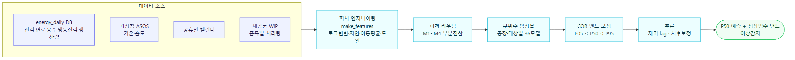
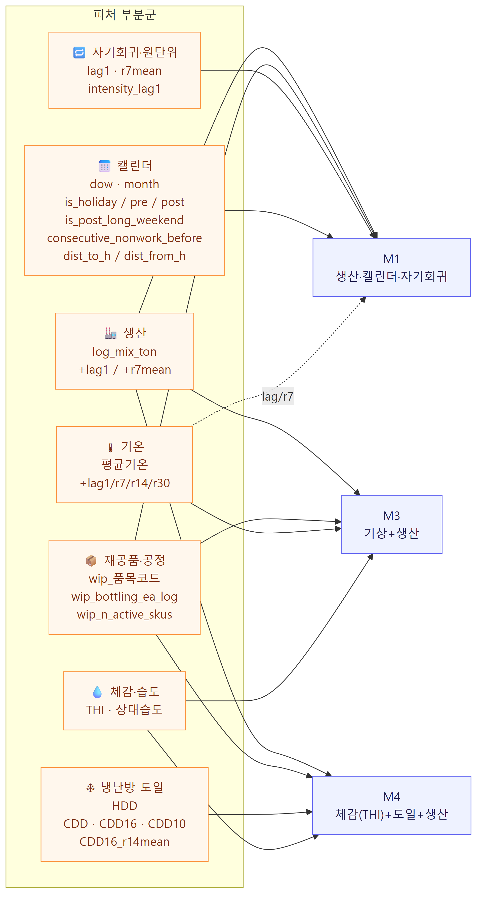
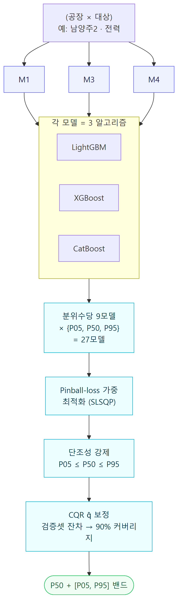
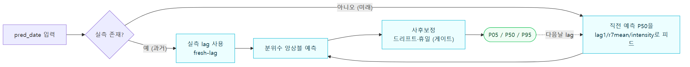
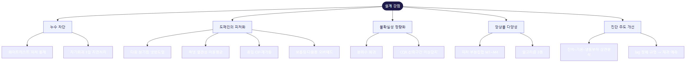

# 에너지 사용량 예측 모델 — 피처 구성도 (v5.3)

식품공장 5개 사업장의 **일별 전력·연료·용수**를 분위수(P05·P50·P95)로 예측.
트리 부스팅 앙상블(LightGBM·XGBoost·CatBoost) × 분위수 회귀 + CQR 보정.

---

## 1. 전체 파이프라인

> 타깃은 **`log1p` 공간**에서 학습(분위수는 단조변환 불변) → `expm1` 역변환.

---

## 2. 피처 구성 → 모델 라우팅

7개 피처 부분군이 서로 다른 시각의 3개 모델(M1·M3·M4)로 라우팅되어 상호보완한다.
*(가중치 감사에서 share≈0으로 죽었던 M2(도일 전용)는 ablation 검증 후 제거 — 도일 피처는 M4가 계속 사용.)*

> 🏭 생산·📦 공정 피처는 **전 모델 공통**, 나머지는 모델별 특화.
> 모든 자기회귀/원단위 피처는 `shift(1)` 처리로 **당일 실측 누수(leakage) 차단**.

---

## 3. 분위수 앙상블 구조 (공장·대상별 27모델)

> 실측이 밴드 **초과 → 과사용 의심↑**, **미만 → 저사용 의심↓** 으로 이상감지.

---

## 4. 추론 — 재귀 미래 lag

다중일-선행 예측에서 미래 날짜의 예측 P50을 history로 되먹여 `lag1`/`r7mean`/`intensity`가
추세를 추종(온난화 램프 과소예측 해소).

> 효과(백테스트): 6월 과소예측 **+3.8% → −0.8%**, MAPE **5.62 → 4.75%**(fresh 수준 복귀).

---

## 5. 포트폴리오 어필 포인트

---
*근거 코드: `app/services/v5_common.py`(피처) · `v5_quantile_training.py`(학습) · `usage_prediction_v5_service.py`(추론·재귀 lag).*
