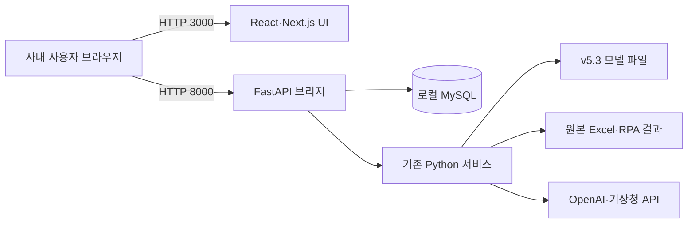

# AI Elite BEMS Next 작업 정리 및 향후 계획

> **최종 갱신: 2026-07-16 / 기준 브랜치: `main` / 독립화 Phase 0·1 완료**
>
> **독립화 결정 (2026-07-16, 사용자):** legacy 의존을 완전히 배제하고 new/ 단독
> 운용을 목표로 한다. 필요한 legacy 파일은 `new/backend/app/`으로 **복사해서**
> 사용한다. 단계별 계획·현황은
> [AI_Elite_BEMS_Next_독립화_계획서.md](AI_Elite_BEMS_Next_독립화_계획서.md)가 기준 문서다.
>
> 현재 GitHub 저장소를 유일한 기준으로 삼는다. 과거 임시 Sites 작업공간에서 만들었다고
> 설명된 프런트엔드 파일과 화면은 커밋·ZIP으로 보존되지 않았으므로 복구 가능한 구현으로
> 간주하지 않는다. 현재 프런트엔드는 저장소 안에서 새로 재구현한 코드다.
>
> **현재 완료:**
>
> - 단일 저장소 안에 `legacy/`와 `new/`를 형제 폴더로 구성하고 GitHub에 반영
> - `new/backend/server.py` FastAPI 브리지와 조회·관리 API 구현
> - `new/app`, `new/components`, `new/lib`에 React 19 + Next.js 15 프런트엔드 기반 구현
> - 반응형 셸과 대시보드·사용량·원단위·생산실적·AI 예측의 핵심 조회 화면 구현
> - API 연결 실패 시 비밀값이 없는 예시 데이터 fallback 구현
> - Windows 설치·실행·방화벽 배치파일과 환경변수 예시 작성
> - npm 의존성 설치 완료 및 재현 가능한 `package-lock.json` 생성
> - 원격 브라우저 API 자동 연결, 공장 마스터, 기준일·원단위 필터와 예측 fallback 타입 오류 수정
> - 운영 생산량 오버레이·생산 F-code/단위·예측 결측·감사 권한·Origin 보호·조회 DB 계정 P0 코드 수정
> - AI 보고서 조회·생성·안전한 Markdown 렌더링·인쇄/PDF React 화면 구현
> - 이벤트·절감 목표·Excel 업로드·감사 로그·예측 이력 관리 React 화면 구현
> - 관리자 단일 예측 미리보기와 엄격한 쓰기 API 오류 처리·요청 경쟁조건 방지 구현
>
> **현재 미완료 또는 미검증:**
>
> - 모델 재학습·기상 동기화·What-if·이상 원인 진단 UI/API 연결
> - 생산실적 기간·연간 모드와 CSV 출력
> - 실제 사내 MySQL·모델·Excel·외부 API를 이용한 수치 동등성 및 권한 검증
> - 브라우저 렌더링·반응형·콘솔 오류 검증
>
> **다음 작업 우선순위:**
>
> 1. 브라우저에서 핵심 조회·보고서·관리자 화면 smoke test
> 2. 백엔드 운영 정확성 P0 수정의 실제 DB 수치·권한 비교
> 3. 재학습·기상 동기화·What-if·이상 진단 API와 React 화면 연결
> 4. 실제 사내 환경에서 기존 Streamlit과 업로드·모델·외부 API 결과 비교

### 작업 현황 보드

| 구분 | 현재 상태 |
|---|---|
| 변경 원칙 | `legacy/`는 읽기 전용 참조본. 필요한 파일은 `new/backend/app/`으로 복사해 사용하고, 결함 수정은 복사본에만 반영(독립화 계획서 "발견·수정 로그" 기록) |
| 현재 진행 | 독립화 Phase 0·1 완료 — legacy 코드 의존 제거, 복사본 기반 단독 실행 검증 |
| 이번 세션 완료 (2026-07-16) | ① 검수: 마이그레이션 정합성 대조(F-코드·생산량 오버레이·권한 legacy 일치 확인) ② 수정: 경산 예측 제외(`PREDICTION_FACTORIES`), 생산량 KPI 색상, mix_prod 목표 라벨 ③ 독립화: app 코드+모델(3.8GB, _archive 제외)+.env 복사, `import_core` 로컬 전환, `_fetch_energy_history` factory 결함 복사본에서 수정, 배치 스크립트 legacy 미참조화 ④ 검증: 백엔드 테스트 24건, 실DB 대시보드·예측 이력, 복사 모델로 김해 실제 예측 실행 성공(51초) |
| 바로 다음 작업 | Phase 2 — 업로드 미리보기 2단계, 이상 진단 연결, legacy 화면과 수치 동등성 스팟체크, RUN_GUIDE·README를 독립 구조 기준으로 정리 |
| 이후 남은 작업 | Phase 3 자동화 독립(엑셀 동기화 스케줄러·기상·재학습·자동시작), Phase 4 UI 세련화·CSV·연간 모드, legacy 퇴역 |

> 작성일: 2026-07-16
> 원본 프로젝트: `kjw413/AI-Elite-BEMS`  
> 신규 프로젝트: `ai-elite-bems-next`  
> 문서 목적: 현재까지의 전환 작업을 인수인계하고, 실제 사내 운영 전까지 필요한 후속 작업과 검증 기준을 명확히 정의한다.

---

## 1. 프로젝트 목표

기존 AI-Elite-BEMS는 Streamlit 기반의 로컬 웹앱으로, 다음 흐름을 제공하고 있었다.

```text
Excel·RPA 결과 → 로컬 MySQL → Streamlit 화면 → 조회·예측·진단·보고
```

Streamlit은 초기 개발과 Python 데이터 앱 구현에는 유리하지만, 화면 조작 시 전체 스크립트가 반복 실행되는 구조로 인해 다음 문제가 발생할 수 있다.

- 화면 렌더링과 DB 조회가 함께 재실행되어 로딩 체감이 커짐
- 여러 사용자가 동시에 접속할 때 세션·리소스 관리가 불안정해질 가능성
- 프런트엔드 상호작용과 Python 계산 로직의 결합도가 높음
- 화면을 세밀하게 디자인하거나 상태를 독립적으로 관리하기 어려움

이번 작업의 목표는 기존 DB·예측모델·업무 규칙을 폐기하지 않고, 화면과 서버 계층을 분리하는 것이다.

```text
React UI → FastAPI → 기존 Python 서비스·로컬 MySQL
```

실제 운영 시 데이터와 모델은 기존처럼 서버 PC 내부에 남고, 같은 사내망 사용자는 PC 이름 기반 링크로 접속하도록 설계했다.

---

## 2. 분석한 기존 시스템 범위

GitHub의 `kjw413/AI-Elite-BEMS` 저장소를 기준으로 다음 항목을 확인했다.

### 2.1 기존 기술 스택

| 영역 | 기존 기술 |
|---|---|
| 웹 UI | Streamlit, Plotly |
| 애플리케이션 | Python, Pandas, NumPy, SciPy |
| 데이터베이스 | 로컬 MySQL |
| DB 연결 | mysql-connector-python, SQLAlchemy, PyMySQL |
| 예측모델 | LightGBM, XGBoost, CatBoost, scikit-learn, Joblib |
| AI 보고서 | OpenAI API, LangChain SQL Agent |
| 자동화 | Excel, Jinja2, Kaleido, Windows 배치파일 |

### 2.2 기존 주요 화면

1. 대시보드
2. 에너지 사용량 통합
3. 에너지 원단위
4. 생산실적 분석
5. AI 에너지 사용 예측
6. AI 에너지 실적 보고서
7. 데이터 업로드
8. 변경 이력 및 이벤트 메모

### 2.3 기존 핵심 데이터 테이블

| 테이블 | 주요 역할 |
|---|---|
| `energy_daily` | 일별 에너지·생산 실적 |
| `energy_daily_audit` | 데이터 변경 이력 |
| `upload_batch` | Excel 업로드 배치 기록 |
| `ai_reports` | AI 월간 보고서 저장 |
| `prediction_log` | 예측·실측·정상범주 이력 |
| `production_daily` | 품목 단위 생산 계획·실적 |
| `anomaly_analysis` | AI 이상 원인 진단 결과 |
| `savings_target` | 공장·연도별 절감 목표 |
| `event_annotation` | 현장 이벤트·원인·조치 메모 |

### 2.4 기존 권한 정책

- 서버 PC에서 접속: 관리자
- 다른 사내 PC에서 접속: 조회 사용자
- 판정 방식: 클라이언트 IP 기반
- 관리자 전용 기능: 업로드, 재학습, 기상 동기화, 보고서 생성, 변경 이력 관리 등

---

## 3. 새로 구현한 시스템 구조

### 3.1 적용 기술

| 계층 | 적용 기술 | 역할 |
|---|---|---|
| 프런트엔드 | React 19, Next.js 15, TypeScript | 화면, 필터, 사용자 상태, 반응형 UI |
| 시각화 | Recharts | 추이·비교·구성비 차트 |
| 아이콘 | Lucide React | 메뉴·상태·업무 아이콘 |
| API | FastAPI, Uvicorn | DB 조회, 권한 검사, 기존 서비스 호출 |
| 데이터 | 기존 로컬 MySQL | 실적·예측·보고서·이력 유지 |
| 업무 로직 | 기존 `app/services` | 예측, 업로드, 보고서 생성 로직 재사용 |

### 3.2 운영 아키텍처



### 3.3 접속 방식

- 프런트엔드: `http://<서버PC이름>:3000`
- API: `http://<서버PC이름>:8000/api/v1`
- API 문서: `http://<서버PC이름>:8000/api/docs`
- 데이터베이스: 서버 PC 로컬 MySQL

브라우저가 API에 직접 요청하기 때문에 FastAPI가 실제 사용자 PC의 IP를 확인할 수 있다. 이를 통해 기존의 IP 기반 관리자·조회자 구분을 유지한다.

---

## 4. 지금까지 완료한 작업

### 4.1 React 기반 전체 화면 셸 구현

- 반응형 사이드바와 상단 필터
- 전사·공장 선택
- 기준일 선택
- 로컬 DB 연결 상태 표시
- 관리자·조회 사용자 표시
- 데스크톱 및 축소 화면 대응
- 연결 실패 시 예시 데이터 자동 전환
- API 주소 미설정 시 브라우저가 접속한 서버 호스트의 `:8000/api/v1` 자동 사용
- 예시 데이터 사용 중임을 본문 경고로 명확히 표시
- 하드코딩 날짜 제거 및 모든 조회 화면에 기준일 전달
- legacy 마스터와 같은 전사·남양주1/2·김해·광주·논산·경산 필터 제공

### 4.2 통합 대시보드

- 전력·연료·용수 원단위 KPI
- 누계 생산량 KPI
- 전년 동기 대비 증감률
- 최근 7일 실제 사용량과 AI 예측값 차트
- 월별 전년 대비 차트
- 공장별 효율 비교
- 최근 현장 이벤트
- FastAPI 실패 시 예시 데이터 fallback

### 4.3 에너지 사용량 화면

- 전력·연료·용수·폐수 전환
- 기간 누계·일평균·최대 사용일
- 일별 사용 추이
- 냉동·공압 등 전력 설비 구성비
- 공장별 사용량 비교

### 4.4 에너지 원단위 화면

- 전력 원단위 MTD·YTD 요약
- 전력·연료·용수 원단위 전환
- 전년도·금년도·목표 추이 비교
- 공장 효율 매트릭스
- 전년 대비 개선·악화 상태 표시

### 4.5 생산실적 분석 화면

- 누계 계획·실적·달성률·예상 착지
- 제품유형별 일일 생산량
- 제품 믹스 구성비
- 주요 품목 계획 대비 실적

### 4.6 AI 예측 화면

- 전력·연료·용수 최근 P50 예측값
- P05~P95 정상범주와 실측값 표
- 최근 예측 이력
- 실측값 기준 상·하단 이탈 표시
- 정상·이탈 건수 요약
- 모델 버전·상태 표시
- 관리자 전용 생산계획 기반 단일 예측 미리보기
- 집계 공장은 기존 배치 예측, 개별 공장은 생산계획 kg 입력 연동
- 실행 결과는 DB에 저장하지 않고 P50·P05·P95·실측·판정만 표시

### 4.7 AI 실적 보고서

- 저장 보고서와 보유월 조회, 관리자 생성·재생성 React 화면
- raw HTML을 실행하지 않는 제목·목록·표·인용·강조·코드 Markdown 렌더러
- 브라우저 인쇄·PDF 출력 전용 레이아웃
- 조회 사용자는 저장 보고서만 열람하고 생성 버튼은 관리자에게만 노출
- AI 서비스의 빈 내용·오류 문자열은 저장 전에 HTTP 502로 차단

### 4.8 관리자 기능

- 이벤트 조회·등록·수정·삭제와 조회 사용자 read-only 화면
- 전력·연료·용수 원단위와 생산량 절감 목표 조회·저장
- Excel 확장자·50MB 검사, 즉시 UPSERT 확인, 업로드·변경 이력 조회
- 예측 누락이력 생성과 실측값 역채움 실행·결과 화면
- 누락이력 생성은 UI와 서버에서 1회 최대 93일로 제한
- 이벤트는 물리 공장만 등록하며 중복 제출을 차단
- 모든 쓰기·감사 API에서 서버 측 IP 관리자 권한을 재검사
- 공장·일자 전환 시 이전 요청을 취소하여 늦은 응답이 새 화면을 덮지 않도록 처리

### 4.9 Windows 실행 환경

다음 배치파일을 작성했다.

| 파일 | 역할 |
|---|---|
| `SETUP_LOCAL.bat` | 읽기 전용 legacy 요구사항과 FastAPI 의존성을 `new/.venv`에 설치, 잠금된 Node 패키지 설치, 빌드 검증 |
| `RUN_BEMS_NEXT.bat` | 현재 소스를 기본 재빌드하고 `new/.venv`로 API 실행, 8000 포트 오점유·20초 readiness와 3000 포트 확인 |
| `CONFIGURE_FIREWALL.bat` | Windows 방화벽 3000·8000 포트 허용 |

현재 폴더 구조는 다음과 같다.

```text
AI-Elite-BEMS/
  legacy/
  new/
```

기존 프로젝트 경로가 다르면 `BEMS_CORE_ROOT` 환경변수로 지정할 수 있다.
`BEMS_CORE_ROOT` 아래 파일은 실행 중 읽기만 하며 패키지나 가상환경을 설치하지 않는다.
`BEMS_SKIP_BUILD=1`은 이미 검증한 번들을 의도적으로 재사용할 때만 선택한다.

### 4.10 문서화

- 설치·운영 가이드 `README.md`
- 서버 오픈·사내망 웹 접속 가이드 `RUN_GUIDE_KR.md`
- 전체 아키텍처 `docs/ARCHITECTURE_KR.md`
- 기능 전환 범위 `docs/MIGRATION_SCOPE_KR.md`
- 환경변수 예시 `.env.local.example`
- 실제 React 구현이 없는 기능을 완료로 표시하던 전환 범위 표를 현재 코드 기준으로 정정
- Next.js 15, 운영 생산량 흐름, Origin 보호, `new/.venv`·legacy read-only 구조로 아키텍처 문서 갱신

---

## 5. 현재 주요 파일 구조

```text
AI-Elite-BEMS/
├─ legacy/
└─ new/
   ├─ app/
   │  ├─ page.tsx
   │  ├─ layout.tsx
   │  └─ globals.css
   ├─ components/
   │  ├─ bems-app.tsx
   │  └─ screens/
   │     ├─ report-screen.tsx
   │     ├─ admin-screen.tsx
   │     └─ prediction-runner.tsx
   ├─ lib/
   │  ├─ bems-api.ts
   │  └─ bems-data.ts
   ├─ backend/
   │  ├─ server.py
   │  ├─ tests/
   │  │  └─ test_server_helpers.py
   │  └─ requirements.txt
   ├─ docs/
   ├─ SETUP_LOCAL.bat
   ├─ RUN_BEMS_NEXT.bat
   ├─ CONFIGURE_FIREWALL.bat
   ├─ RUN_GUIDE_KR.md
   ├─ package-lock.json
   └─ README.md
```

### 핵심 파일 역할

- `components/bems-app.tsx`: 메뉴, 공통 필터와 조회 화면·상호작용
- `components/screens/report-screen.tsx`: 월간 보고서 조회·생성·Markdown·인쇄
- `components/screens/admin-screen.tsx`: 이벤트·목표·업로드·감사·예측 이력 관리
- `components/screens/prediction-runner.tsx`: 관리자 단일 예측 미리보기
- `lib/bems-api.ts`: FastAPI 엄격 요청, 오류 정규화와 조회 화면 예시 데이터 fallback
- `lib/bems-data.ts`: 개발·미리보기용 예시 데이터와 타입
- `backend/server.py`: MySQL 조회 및 기존 Python 서비스 연결
- `backend/tests/test_server_helpers.py`: DB 비의존 수치·권한·Origin 회귀 테스트
- `app/globals.css`: 대시보드 디자인과 반응형 스타일

---

## 6. 검증한 항목

### 6.1 코드 검사

- Python `new/backend` 문법 검사(`python -m compileall new\\backend`) 통과
- 전체 신규 패치의 `git diff --check` 통과
- `npm run typecheck` 통과
- `new/.venv`에서 FastAPI 브리지 모듈 import 성공(24개 route 등록)
- `python -m unittest discover -s backend/tests -v`로 helper·윤년·Origin·생산 집계/F10·예측 완전성·viewer 403·조회 계정·보고서 실패 저장·이벤트 공장·예측 기간 상한 테스트 20건 통과
- ESLint 전용 패키지·설정은 아직 없어 별도 lint 검증은 미수행

### 6.2 브라우저 검증

- `next start`가 967 ms에 준비되고 `http://127.0.0.1:3000`이 HTTP 200과 앱 HTML을 반환하는 기동 smoke 통과
- 응답 HTML에 앱 제목과 API 장애 시 예시 데이터 경고가 포함됨을 확인
- 실제 브라우저의 차트 렌더링·콘솔 오류·메뉴 상호작용·모바일 반응형 smoke test는 아직 수행하지 않음
- 2026-07-16 현재 PC에서는 로컬 서버 기동 승인 한도로 headless 브라우저 추가 검증을 수행하지 못했으며 코드·빌드 실패와 구분해 미검증으로 유지
- 과거 임시 Sites 작업공간에서의 검증 결과는 현재 저장소 검증 결과로 인정하지 않음

### 6.3 빌드 검증

- Node.js `v24.14.1`, npm `11.11.0` 환경에서 시스템 CA를 사용한 `npm ci --no-audit --no-fund` 성공
- npm 패키지 66개 설치 및 `package-lock.json` 생성 완료
- 잠금파일 기준 `npm ci --no-audit --no-fund` 재현 설치 성공(66개 패키지)
- `npm run typecheck` 스크립트 추가
- 설치·실행 스크립트가 legacy 가상환경을 변경하지 않고 독립 `new/.venv`를 사용하도록 수정
- 샌드박스 밖에서 `npm run build` 실행 시 Next.js 번들 컴파일은 성공
- TypeScript 검사에서 `demo.prediction`과 실제 `demo.predictions` 키 불일치 1건이 발견되어 빌드는 실패
- 명시적 화면별 fallback 매핑으로 키 불일치를 수정하고 `npm run typecheck` 통과
- 수정 후 `npm run build` 재실행 성공: 컴파일·타입 검사·정적 페이지 4개 생성 완료
- `npm ci` 직후 빌드와 최종 변경 후 재빌드 모두 통과(최종 컴파일 3.1초)
- 생성 결과: 메인 경로 `/` 약 136 kB 정적 렌더, First Load JS 약 239 kB, 정적 페이지 4개

### 6.4 이번 세션에서 완료한 프런트 P0 조치

| 확인된 문제 | 조치 | 검증 |
|---|---|---|
| 원격 PC에서 API 기본주소가 사용자 PC의 localhost를 가리킴 | 현재 브라우저 호스트 기반 API 주소 자동 구성, 환경변수 이름 통일·하위호환 | TypeScript 통과 |
| React 공장 목록에 실제 논산 대신 대전이 있음 | legacy 공장 마스터 기준 목록으로 교체 | 코드 대조 완료 |
| 예측 화면 fallback 키가 달라 빌드 실패 | 명시적 화면별 fallback 매핑 적용 | `npm run typecheck` 통과 |
| 기준일이 대시보드 외 화면에서 무시됨 | 모든 조회 요청에 `date` 전달 | API 계약 반영 |
| 원단위가 전력으로 고정됨 | 전력·연료·용수 선택과 API `metric` 연동 | TypeScript 통과 |
| API 장애 시 demo 수치를 실데이터로 오인할 수 있음 | 본문에 운영 판단 금지 경고 표시 | 렌더 코드 확인 |
| P05~P95 차트가 하한을 무시하고 0부터 상한까지 채움 | `[lower, upper]` 범위 Area로 변경, 결측 band는 연결하지 않음 | TypeScript 통과 |
| 용수 원단위가 한 자리로 잘림 | `ton/ton` KPI는 소수 둘째 자리 유지 | TypeScript 통과 |

### 6.5 이번 세션에서 완료한 백엔드 P0 코드 조치

| 확인된 문제 | 조치 | 현재 검증 수준 |
|---|---|---|
| 대시보드·원단위가 원본 `mix_prod_kg`를 분모로 사용 | 조회 전용 연결로 `production_daily.actual_qty`를 읽고 legacy 광주 WIP 환산 규칙만 재사용 | Python 문법·단위 테스트 통과, 실제 DB 비교 필요 |
| `production_daily`를 한글 공장명으로 조회하고 kg를 ton으로 표시 | F10/F10A/F10B/F20/F30/F40/F50 필터와 API 경계 kg→ton 변환, 개별 남양주 과거 F10 호환 | 단위 테스트 통과, 실제 DB 비교 필요 |
| 31일 고정 예상착지·2월 29일 전년 비교·plan 0 오류 | 실제 월 일수, 윤년 보정, 0 분모 null 처리 | 윤년·기준일 단위 테스트 통과 |
| 일부 공장 예측만 있어도 전사·남양주를 정상으로 판정 | 모든 구성 공장 값이 있을 때만 합산하고 불완전 데이터는 `unknown` | 완전·불완전 구성원 단위 테스트 통과, 실제 DB 검증 필요 |
| band 없는 point 예측을 누락하거나 가상 band로 표시 | P50은 유지하되 P05/P95는 null, 판정은 `unknown` 처리 | 단위 테스트 통과 |
| 예측 누락 시 실측값과 ±7% 가상 밴드 생성 | live API에서는 예측·밴드를 null로 반환 | 코드 대조 완료 |
| viewer가 감사 로그·예측 실행을 호출할 수 있음 | 감사·예측 실행 API에 서버 측 관리자 검사 추가 | viewer 선차단 단위 테스트 통과, 실제 다른 PC 403 확인 필요 |
| 임의 `:3000` Origin과 내부 오류·경로 노출 | 기본+추가 exact Origin allowlist·unsafe 요청 차단, 고정 외부 오류 메시지 적용 | 추가 목록·불허 unsafe Origin 단위 테스트 통과, 실환경 CORS 확인 필요 |
| 운영 생산량 위임을 포함한 GET 경로가 관리자 DB 계정을 사용할 수 있음 | 모든 브리지 조회를 필수 `DB_VIEWER_USER`·`DB_VIEWER_PASSWORD` 경로로 분리하고 광주 WIP 파일 규칙만 위임 | 계정 선택·누락 시 일반 503·운영 생산 조회 단위 테스트 통과, 실제 SELECT grant 확인 필요 |
| 과거 `F10`과 분할 `F10A/F10B`가 겹치거나 분모에서 누락될 수 있음 | 분할 데이터가 있는 날짜는 parent `F10`을 제외하고, 과거 parent 행은 한 번만 남양주 집계에 포함 | 날짜별 F10 회귀 테스트 통과, 실제 과거 DB 비교 필요 |
| legacy import가 bytecode를 쓸 수 있음 | 서버와 실행기에 bytecode 쓰기 금지 적용 | `legacy/` Git 상태 무변경 확인 |

### 6.6 FastAPI HTTP smoke

- 독립 `new/.venv`에서 FastAPI 기동 및 24개 route 등록 성공
- `GET /api/v1/session`: localhost 관리자 판정과 HTTP 200 확인
- 허용 Origin `http://localhost:3000`의 DELETE preflight: HTTP 200과 CORS 헤더 확인
- 불허 Origin `http://evil.example:3000`의 DELETE preflight: HTTP 403 확인
- MySQL 미실행 상태의 `GET /api/v1/health`: 내부 경로·예외를 응답에 노출하지 않고 고정 메시지 HTTP 503 확인
- 실제 MySQL 연결·원단위·생산·예측 수치 응답은 사내 환경에서 추가 검증 필요

### 6.7 2026-07-16 보고서·관리자 UI 안정화

| 확인된 문제 | 조치 | 검증 |
|---|---|---|
| AI 서비스 오류 문자열이 정상 보고서로 저장될 수 있음 | 빈 내용·오류 문자열을 저장 전에 HTTP 502로 차단 | 백엔드 단위 테스트 통과 |
| 공장·일자 변경 뒤 이전 응답이 새 화면을 덮을 수 있음 | 보고서·이벤트·목표·예측·감사 요청에 `AbortController` 적용 | TypeScript·빌드 통과 |
| 전사·남양주 이벤트가 조회되지 않는 값으로 저장될 수 있음 | UI와 서버에서 남양주1/2·개별 물리 공장만 등록 허용 | 백엔드 단위 테스트 통과 |
| 예측 누락이력에 과도한 기간을 입력할 수 있음 | 실행 확인과 UI·서버 93일 상한 적용 | 백엔드 단위 테스트 통과 |
| 보유월 API 실패가 성공한 보고서 본문까지 지움 | 두 요청을 독립 처리해 본문을 유지 | TypeScript·빌드 통과 |
| 목표·업로드·이벤트 세부 운영 결함 | 생산량 목표 추가, 남양주 공통 범위 표시, 중복 등록 차단, 파일 input 초기화 | TypeScript·빌드 통과 |

---

## 7. 현재 확인하지 못한 사항

개발 환경에는 사용자의 실제 사내 MySQL, `.env`, Excel 원본과 대용량 v5.3 모델 파일이 없었다. 따라서 다음 항목은 서버 PC에서 추가 검증해야 한다.

1. 현재 GitHub 프런트엔드의 실제 브라우저 렌더링·콘솔·반응형 동작
2. 실제 DB 스키마·조회 계정 grant로 FastAPI 연결
3. 기존 Streamlit과 신규 React의 수치 일치
4. `production_daily.actual_qty`와 광주 WIP 오버레이 결과
5. 남양주1·남양주2·남양주 집계 일치
6. 전사·공장별 원단위 계산 결과
7. v5.3 모델 파일 로딩과 실제 예측 실행
8. OpenAI API를 이용한 보고서 생성
9. 기상청 API 동기화
10. 실제 Excel 업로드·UPSERT·감사 로그
11. 다른 사내 PC에서 viewer 권한 판정

---

## 8. 아직 남은 기능 작업

### 8.1 핵심 우선 작업

#### A. 실제 DB 기준 수치 동등성 검증

신규 API 결과와 기존 Streamlit 결과를 동일 조건으로 비교해야 한다.

권장 비교 조건:

| 비교 항목 | 조건 |
|---|---|
| 전사 대시보드 | 동일 기준일 |
| 남양주 집계 | 남양주1+남양주2 |
| MTD 사용량 | 동일 월·동일 마감일 |
| 원단위 | 사용량 ÷ 운영 생산량(`production_daily.actual_qty` + 광주 WIP 환산량) |
| YoY | 동일 월과 전년 동월 |
| 예측 이력 | 동일 공장·일자·target |

허용 오차는 표시 반올림 범위 이내로 설정한다.

#### B. 실제 사내 PC 최초 구동

- `SETUP_LOCAL.bat` 실행
- FastAPI 패키지 설치 확인
- `RUN_BEMS_NEXT.bat` 실행
- MySQL 연결 확인
- 브라우저의 `Local DB` 상태 확인
- 서버 PC에서 관리자 메뉴 확인
- 다른 PC에서 조회자 메뉴 확인

#### C. 보안 검증

- DB 계정과 비밀번호가 브라우저 번들에 포함되지 않는지 확인
- OpenAI·기상청 API 키가 API 응답이나 콘솔에 노출되지 않는지 확인
- viewer가 업로드·보고서 생성 API를 직접 호출해도 403이 반환되는지 확인
- 3000·8000 포트가 사내망 외부에서 접근되지 않는지 확인

### 8.2 기능 보완 작업

현재 UI 구조는 마련했지만 다음 기능은 API 또는 세부 로직 연결이 남아 있다.

| 기능 | 현재 상태 | 남은 작업 |
|---|---|---|
| 절감 목표 설정 | 원단위·생산량 목표 조회·저장 UI/API 구현 | 실제 DB 저장·표시 검증 |
| 이벤트 메모 | 조회·등록·수정·삭제 UI/API 구현 | 실제 DB CRUD와 viewer 검증 |
| 예측 누락이력 생성 | 실행·확인·결과 UI와 93일 제한 구현 | 실제 모델·DB 작업 검증 |
| 실측값 역채움 | 실행 확인·결과 UI/API 구현 | 복사 DB 역채움 검증 |
| Excel 업로드·감사 로그 | 즉시 UPSERT 확인·업로드·감사 UI/API 구현 | 복사 DB 검증, 필요 시 2단계 preview 추가 |
| AI 보고서 | 조회·월 선택·생성·Markdown·인쇄/PDF 구현 | 실제 OpenAI·DB·인쇄 결과 검증 |
| 단일 예측 실행 | 관리자 미리보기 UI/API 구현, 결과 비저장 | 실제 v5.3 모델 결과 검증 |
| 모델 재학습 | legacy 서비스만 존재 | FastAPI 작업 상태 API와 React UI |
| 기상청 동기화 | legacy 서비스만 존재 | FastAPI 동기화 API와 결과 UI |
| What-if 분석 | legacy 영향계수 서비스만 존재 | FastAPI 계수 API와 분석 UI |
| 생산실적 연간 모드 | 핵심 월간 화면만 구현 | 기간·연간·카테고리 다중필터 이식 |
| 이상 원인 진단 | legacy 서비스만 존재 | 진단 FastAPI와 결과 UI |

### 8.3 운영 안정화 작업

- API 요청 시간과 DB 조회시간 로깅
- 페이지별 응답 캐시 정책 설계
- MySQL 인덱스 사용 여부 확인
- 장시간 예측·재학습 작업을 Background Worker로 분리
- 프런트엔드·API 프로세스 자동 재시작
- Windows 작업 스케줄러 자동 시작 등록
- 서버 종료·재시작·장애 대응 로그 작성
- 일일 백업과 복구 절차 문서화

### 8.4 테스트 자동화

현재 `new/backend/tests/test_server_helpers.py`에 DB 비의존 단위 테스트 20건을 추가했다.
운영 DB와 legacy 서비스 결과를 비교하는 통합 테스트는 아래 권장 범위와 함께 아직 남아 있다.

권장 테스트 범위:

1. FastAPI 권한 테스트
2. 공장 집계 SQL 테스트
3. 원단위 계산 테스트
4. 빈 데이터·0 생산량 처리
5. API 응답 스키마 테스트
6. Excel 업로드 validation 테스트
7. React 주요 메뉴 smoke test
8. 예측·보고서 버튼 중복 실행 방지
9. 5~10명 동시 조회 부하 테스트

---

## 9. 권장 진행 순서

### Phase 0. 현재 GitHub 프런트엔드 실행 검증

1. npm 의존성 설치
2. TypeScript 검사와 프로덕션 빌드
3. 핵심 조회 화면 5종 브라우저 smoke test
4. API 미연결 상태의 예시 데이터 fallback 확인

완료 기준:

- `npm run build` 성공
- 브라우저 콘솔 오류 없음
- 데스크톱·모바일 메뉴와 필터 정상 동작

### Phase 1. 실제 환경 연결과 동등성 검증

예상 목표: 신규 화면이 기존 Streamlit과 동일한 수치를 제공하도록 만든다.

1. 서버 PC에 신규 프로젝트 배치
2. 로컬 MySQL 연결
3. 공장·기간별 결과 비교
4. 단위 변환 오류 수정
5. 생산량 오버레이 검증
6. 예측 실행 검증

완료 기준:

- 주요 KPI와 차트의 수치가 기존 화면과 일치
- 관리자·조회자 권한이 정상 적용
- 실제 DB 연결 상태가 화면에 `Local DB`로 표시

### Phase 2. 관리자 기능 완성

1. [x] 절감 목표 저장
2. [x] 이벤트 등록·수정·삭제
3. [x] 예측 누락이력 생성
4. [x] 실측값 역채움
5. [ ] 재학습 상태·로그 표시
6. [ ] 기상 데이터 동기화 결과 표시

완료 기준:

- 기존 관리자 업무를 Streamlit 없이 수행 가능
- 모든 쓰기 작업이 감사 로그에 기록

### Phase 3. 생산·AI 분석 기능 완성

1. 생산실적 기간·연간 모드
2. 실제 회귀계수 기반 What-if
3. AI 이상 원인 진단
4. 보고서 Markdown 전체 지원(핵심 Markdown·인쇄/PDF 완료, 세부 문법 보완 남음)
5. CSV·PDF 출력 형식 개선

완료 기준:

- 기존 분석 기능의 실질적 기능 동등성 확보
- 사용자가 기존 화면을 병행할 필요가 없음

### Phase 4. 안정화와 전환

1. 5~10명 동시 접속 테스트
2. 조회·예측·보고서 응답시간 측정
3. Windows 자동시작·자동복구
4. 운영 로그·백업·복구 절차 확정
5. 기존 Streamlit을 일정 기간 read-only로 병행
6. 문제없을 경우 React 시스템을 공식 링크로 전환

완료 기준:

- 동시 접속 중 오류·세션 충돌 없음
- 서버 재부팅 후 자동 실행
- 장애 발생 시 기존 Streamlit으로 임시 복귀 가능

---

## 10. 권장 성능 목표

| 항목 | 목표 |
|---|---:|
| 첫 화면 로딩 | 사내망 기준 3초 이내 |
| 일반 DB 조회 | 2초 이내 |
| 페이지 전환 | 1초 내 반응 시작 |
| CSV 생성 | 3초 이내 |
| 예측 실행 | 기존 모델 실행시간 이하 |
| 동시 조회 사용자 | 최소 10명 |
| 일반 조회 오류율 | 1% 미만 |

DB 조회가 목표를 초과하면 다음 순서로 점검한다.

1. 조회 범위와 SELECT 컬럼 축소
2. `EXPLAIN`으로 인덱스 확인
3. 기간·공장별 캐시 적용
4. 반복 집계 테이블 또는 materialized summary 검토
5. 예측·보고서와 일반 조회 프로세스 분리

---

## 11. 주요 위험과 대응

| 위험 | 영향 | 대응 |
|---|---|---|
| 생산량 집계 차이 | 원단위 전체 오차 | 기존 overlay 로직과 API 결과 비교 |
| 프록시 사용 시 IP 손실 | 모든 사용자가 admin으로 오판 | 현재처럼 브라우저가 API에 직접 접속하거나 trusted proxy 정책 적용 |
| 장시간 모델 실행 | API 응답 지연 | Background Worker와 작업 상태 API 도입 |
| 로컬 PC 종료 | 전 사용자 접속 불가 | 자동 시작·절전 해제·운영 PC 지정 |
| 방화벽 포트 미설정 | 다른 PC 접속 불가 | 3000·8000 인바운드 규칙 확인 |
| Sites에서 로컬 DB 접근 시도 | 연결 실패·보안 위험 | Sites는 UI 검토용, 실제 운영은 사내 PC 주소 사용 |
| GitHub 저장소 공개 상태 | 소스 노출 가능 | 비밀값 미커밋 확인, 필요 시 private 전환 검토 |

---

## 12. Sites 배포와 사내 운영의 차이

Sites에 배포된 클라우드 웹은 사내 PC 안의 MySQL에 직접 접근할 수 없다. 브라우저 보안과 회사 방화벽을 우회해 로컬 DB를 연결하는 구조도 권장하지 않는다.

따라서 현재 구조는 다음처럼 구분한다.

| 환경 | 목적 | 데이터 |
|---|---|---|
| Sites·개발 미리보기 | UI·상호작용 검토 | 예시 데이터 |
| 서버 PC 사내망 실행 | 실제 운영 | 로컬 MySQL·모델·Excel |

외부에서도 실데이터가 필요한 경우에는 회사가 승인한 VPN, Zero Trust 터널, 사내 리버스 프록시와 별도의 사용자 인증 체계가 필요하다. 이는 이번 구현 범위에 포함하지 않았다.

---

## 13. GitHub 반영 상태

- 저장소: `kjw413/AI-Elite-BEMS`
- 브랜치: `main`
- 현재 구조: 같은 저장소 안의 `legacy/`, `new/` 형제 폴더
- `legacy/`: 기존 Streamlit 운영 코드
- `new/`: React/Next.js + FastAPI 마이그레이션 코드
- 프런트엔드 핵심 조회 화면 커밋: `bed476d`
- 이번 마일스톤 직전 기준 커밋: `3f5ba01`
- 작업 시작 시 `origin/main`과 로컬 HEAD가 `3f5ba01`로 일치함을 확인
- 2026-07-16 보고서·관리자·예측 실행 마일스톤 커밋: `b5d8847`
- 이 문서는 해당 기능 커밋 검증 결과와 후속 작업 상태를 반영함
- `legacy/`에는 tracked 변경과 bytecode·`__pycache__`가 모두 0건임을 확인
- 과거 임시 Sites 작업공간의 미커밋 산출물은 현재 구현 상태에 포함하지 않음

전환 기간에는 두 폴더를 같은 버전 이력으로 관리하되, 실제 운영 전환 전까지
`legacy/`를 삭제하지 않고 비교·비상 복귀용으로 유지한다.

---

## 14. 다음 작업 시작 시 확인할 체크리스트

- [x] `legacy/`, `new/` 형제 폴더 구성
- [x] 기준 커밋 `3f5ba01`까지 `origin/main` 반영
- [x] 2026-07-16 보고서·관리자·예측 실행 변경 커밋 `b5d8847` 생성
- [ ] MySQL 서비스 실행
- [ ] legacy 소스·`.env`·모델 위치 확인(legacy 폴더는 읽기 전용 유지)
- [ ] v5.3 모델 파일 위치 확인
- [x] Node.js 22.13 이상 설치
- [x] `new/`에서 npm 의존성 설치 및 `package-lock.json` 생성
- [x] `new/`에서 TypeScript 검사
- [x] `new/`에서 프로덕션 빌드
- [ ] `SETUP_LOCAL.bat`로 `new/.venv` 생성 및 의존성·빌드 검증
- [ ] Windows 방화벽 3000·8000 허용
- [ ] `RUN_BEMS_NEXT.bat` 실행
- [ ] 서버 PC 관리자 판정 확인
- [ ] 다른 PC viewer 판정 확인
- [ ] 대시보드 수치 비교
- [ ] 생산량·원단위 비교
- [ ] 실제 예측 실행
- [ ] 보고서 생성·저장
- [ ] 복사 DB에서 Excel 업로드 테스트
- [ ] 5명 이상 동시 접속 테스트

---

## 15. 최종 요약

현재 작업트리에는 `legacy/`와 `new/`의 형제 폴더 구조, FastAPI 브리지, Windows 실행
스크립트, React 기반 핵심 조회 화면 5종과 보고서·관리자·단일 예측 실행 화면이 구현돼 있다.
이벤트·절감 목표·업로드·감사·예측 이력 관리도 기존 FastAPI 쓰기 API와 연결됐다.

npm 재현 설치, TypeScript 검사, 프로덕션 빌드와 백엔드 단위 테스트 20건은 완료됐다.
다음 단계는 실제 브라우저 smoke와 사내 DB·OpenAI·모델·Excel을 사용한 동등성 검증이며,
그 후 재학습·기상 동기화·What-if·이상 원인 진단과 생산실적 연간 모드를 연결한다.

운영 전환 전까지는 기존 Streamlit을 즉시 제거하지 말고, React 시스템과 일정 기간 병행하여 수치·권한·업로드 결과를 비교하는 방식이 가장 안전하다.
