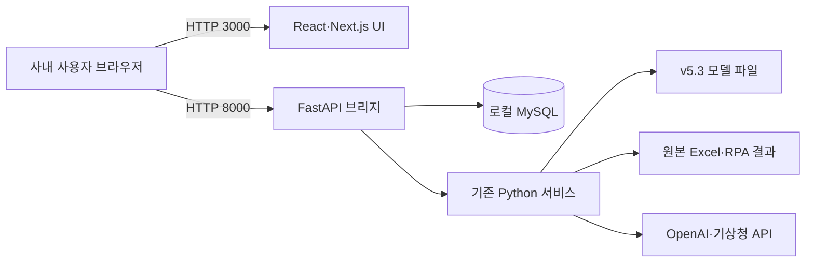

# AI Elite BEMS Next 작업 정리 및 향후 계획

> **최종 갱신: 2026-07-15 / 기준 커밋: `bed476d`**
>
> 현재 GitHub 저장소를 유일한 기준으로 삼는다. 과거 임시 Sites 작업공간에서 만들었다고
> 설명된 프런트엔드 파일과 화면은 커밋·ZIP으로 보존되지 않았으므로 복구 가능한 구현으로
> 간주하지 않는다. 현재 프런트엔드는 저장소 안에서 새로 재구현한 코드다.
>
> **현재 완료:**
>
> - 단일 저장소 안에 `legacy/`와 `new/`를 형제 폴더로 구성하고 GitHub에 반영
> - `new/backend/server.py` FastAPI 브리지와 조회·관리 API 구현
> - `new/app`, `new/components`, `new/lib`에 React 19 + Next.js 15 프런트엔드 기반 구현
> - 반응형 셸과 대시보드·사용량·원단위·생산실적·AI 예측의 핵심 조회 화면 구현
> - API 연결 실패 시 비밀값이 없는 예시 데이터 fallback 구현
> - Windows 설치·실행·방화벽 배치파일과 환경변수 예시 작성
>
> **현재 미완료 또는 미검증:**
>
> - AI 보고서와 관리자 기능의 React 화면 및 쓰기 동작 연결
> - 예측 실행·재학습·기상 동기화·What-if·이상 원인 진단 UI 연결
> - npm 의존성 설치와 `npm run build` 검증
> - 실제 사내 MySQL·모델·Excel·외부 API를 이용한 수치 동등성 및 권한 검증
> - 브라우저 렌더링·반응형·콘솔 오류 검증
>
> **다음 작업 우선순위:**
>
> 1. `npm install --no-audit --no-fund` 후 `npm run build` 실행 및 오류 수정
> 2. 브라우저에서 핵심 조회 화면 5종 smoke test
> 3. AI 보고서·관리자 React 화면과 이미 구현된 FastAPI 쓰기 API 연결
> 4. 실제 사내 환경에서 기존 Streamlit과 수치·권한·업로드 결과 비교

> 작성일: 2026-07-15  
> 원본 프로젝트: `kjw413/AI-Elite-BEMS`  
> 신규 프로젝트: `ai-elite-bems-next`  
> 문서 목적: 현재까지의 전환 작업을 인수인계하고, 실제 사내 운영 전까지 필요한 후속 작업과 검증 기준을 명확히 정의한다.

---

## 1. 프로젝트 목표

기존 AI-Elite-BEMS는 Streamlit 기반의 로컬 웹앱으로, 다음 흐름을 제공하고 있었다.

```text
Excel·RPA 결과 → 로컬 MySQL → Streamlit 화면 → 조회·예측·진단·보고
```

Streamlit은 초기 개발과 Python 데이터 앱 구현에는 유리하지만, 화면 조작 시 전체 스크립트가 반복 실행되는 구조로 인해 다음 문제가 발생할 수 있다.

- 화면 렌더링과 DB 조회가 함께 재실행되어 로딩 체감이 커짐
- 여러 사용자가 동시에 접속할 때 세션·리소스 관리가 불안정해질 가능성
- 프런트엔드 상호작용과 Python 계산 로직의 결합도가 높음
- 화면을 세밀하게 디자인하거나 상태를 독립적으로 관리하기 어려움

이번 작업의 목표는 기존 DB·예측모델·업무 규칙을 폐기하지 않고, 화면과 서버 계층을 분리하는 것이다.

```text
React UI → FastAPI → 기존 Python 서비스·로컬 MySQL
```

실제 운영 시 데이터와 모델은 기존처럼 서버 PC 내부에 남고, 같은 사내망 사용자는 PC 이름 기반 링크로 접속하도록 설계했다.

---

## 2. 분석한 기존 시스템 범위

GitHub의 `kjw413/AI-Elite-BEMS` 저장소를 기준으로 다음 항목을 확인했다.

### 2.1 기존 기술 스택

| 영역 | 기존 기술 |
|---|---|
| 웹 UI | Streamlit, Plotly |
| 애플리케이션 | Python, Pandas, NumPy, SciPy |
| 데이터베이스 | 로컬 MySQL |
| DB 연결 | mysql-connector-python, SQLAlchemy, PyMySQL |
| 예측모델 | LightGBM, XGBoost, CatBoost, scikit-learn, Joblib |
| AI 보고서 | OpenAI API, LangChain SQL Agent |
| 자동화 | Excel, Jinja2, Kaleido, Windows 배치파일 |

### 2.2 기존 주요 화면

1. 대시보드
2. 에너지 사용량 통합
3. 에너지 원단위
4. 생산실적 분석
5. AI 에너지 사용 예측
6. AI 에너지 실적 보고서
7. 데이터 업로드
8. 변경 이력 및 이벤트 메모

### 2.3 기존 핵심 데이터 테이블

| 테이블 | 주요 역할 |
|---|---|
| `energy_daily` | 일별 에너지·생산 실적 |
| `energy_daily_audit` | 데이터 변경 이력 |
| `upload_batch` | Excel 업로드 배치 기록 |
| `ai_reports` | AI 월간 보고서 저장 |
| `prediction_log` | 예측·실측·정상범주 이력 |
| `production_daily` | 품목 단위 생산 계획·실적 |
| `anomaly_analysis` | AI 이상 원인 진단 결과 |
| `savings_target` | 공장·연도별 절감 목표 |
| `event_annotation` | 현장 이벤트·원인·조치 메모 |

### 2.4 기존 권한 정책

- 서버 PC에서 접속: 관리자
- 다른 사내 PC에서 접속: 조회 사용자
- 판정 방식: 클라이언트 IP 기반
- 관리자 전용 기능: 업로드, 재학습, 기상 동기화, 보고서 생성, 변경 이력 관리 등

---

## 3. 새로 구현한 시스템 구조

### 3.1 적용 기술

| 계층 | 적용 기술 | 역할 |
|---|---|---|
| 프런트엔드 | React 19, Next.js 15, TypeScript | 화면, 필터, 사용자 상태, 반응형 UI |
| 시각화 | Recharts | 추이·비교·구성비 차트 |
| 아이콘 | Lucide React | 메뉴·상태·업무 아이콘 |
| API | FastAPI, Uvicorn | DB 조회, 권한 검사, 기존 서비스 호출 |
| 데이터 | 기존 로컬 MySQL | 실적·예측·보고서·이력 유지 |
| 업무 로직 | 기존 `app/services` | 예측, 업로드, 보고서 생성 로직 재사용 |

### 3.2 운영 아키텍처



### 3.3 접속 방식

- 프런트엔드: `http://<서버PC이름>:3000`
- API: `http://<서버PC이름>:8000/api/v1`
- API 문서: `http://<서버PC이름>:8000/api/docs`
- 데이터베이스: 서버 PC 로컬 MySQL

브라우저가 API에 직접 요청하기 때문에 FastAPI가 실제 사용자 PC의 IP를 확인할 수 있다. 이를 통해 기존의 IP 기반 관리자·조회자 구분을 유지한다.

---

## 4. 지금까지 완료한 작업

### 4.1 React 기반 전체 화면 셸 구현

- 반응형 사이드바와 상단 필터
- 전사·공장 선택
- 기준일 선택
- 로컬 DB 연결 상태 표시
- 관리자·조회 사용자 표시
- 데스크톱 및 축소 화면 대응
- 연결 실패 시 예시 데이터 자동 전환

### 4.2 통합 대시보드

- 전력·연료·용수 원단위 KPI
- 누계 생산량 KPI
- 전년 동기 대비 증감률
- 최근 7일 실제 사용량과 AI 예측값 차트
- 월별 전년 대비 차트
- 공장별 효율 비교
- 최근 현장 이벤트
- FastAPI 실패 시 예시 데이터 fallback

### 4.3 에너지 사용량 화면

- 전력·연료·용수·폐수 전환
- 기간 누계·일평균·최대 사용일
- 일별 사용 추이
- 냉동·공압 등 전력 설비 구성비
- 공장별 사용량 비교

### 4.4 에너지 원단위 화면

- 전력 원단위 MTD·YTD 요약
- 전년도·금년도·목표 추이 비교
- 공장 효율 매트릭스
- 전년 대비 개선·악화 상태 표시

### 4.5 생산실적 분석 화면

- 누계 계획·실적·달성률·예상 착지
- 제품유형별 일일 생산량
- 제품 믹스 구성비
- 주요 품목 계획 대비 실적

### 4.6 AI 예측 화면

- 전력·연료·용수 최근 P50 예측값
- P05~P95 정상범주와 실측값 표
- 최근 예측 이력
- 실측값 기준 상·하단 이탈 표시
- 정상·이탈 건수 요약
- 모델 버전·상태 표시

### 4.7 AI 실적 보고서

- FastAPI의 저장 보고서 조회, 보유월 조회, 보고서 생성 API는 구현됨
- React 보고서 화면, Markdown 렌더링, 인쇄·PDF UI는 아직 미구현

### 4.8 관리자 기능

- FastAPI의 Excel 업로드, 감사 로그, 절감 목표, 이벤트 CRUD API는 구현됨
- 예측 누락이력 생성과 실측값 역채움 관리자 API는 구현됨
- 관리자 쓰기 API의 서버 측 IP 권한 검사는 구현됨
- React 관리자 화면과 각 쓰기 동작 연결은 아직 미구현

### 4.9 Windows 실행 환경

다음 배치파일을 작성했다.

| 파일 | 역할 |
|---|---|
| `SETUP_LOCAL.bat` | Node 패키지와 FastAPI 의존성 설치 |
| `RUN_BEMS_NEXT.bat` | 프런트엔드 빌드, API와 웹 서버 실행 |
| `CONFIGURE_FIREWALL.bat` | Windows 방화벽 3000·8000 포트 허용 |

현재 폴더 구조는 다음과 같다.

```text
AI-Elite-BEMS/
  legacy/
  new/
```

기존 프로젝트 경로가 다르면 `BEMS_CORE_ROOT` 환경변수로 지정할 수 있다.

### 4.10 문서화

- 설치·운영 가이드 `README.md`
- 전체 아키텍처 `docs/ARCHITECTURE_KR.md`
- 기능 전환 범위 `docs/MIGRATION_SCOPE_KR.md`
- 환경변수 예시 `.env.local.example`

---

## 5. 현재 주요 파일 구조

```text
AI-Elite-BEMS/
├─ legacy/
└─ new/
   ├─ app/
   │  ├─ page.tsx
   │  ├─ layout.tsx
   │  └─ globals.css
   ├─ components/
   │  └─ bems-app.tsx
   ├─ lib/
   │  ├─ bems-api.ts
   │  └─ bems-data.ts
   ├─ backend/
   │  ├─ server.py
   │  └─ requirements.txt
   ├─ docs/
   ├─ SETUP_LOCAL.bat
   ├─ RUN_BEMS_NEXT.bat
   ├─ CONFIGURE_FIREWALL.bat
   └─ README.md
```

### 핵심 파일 역할

- `components/bems-app.tsx`: 메뉴와 전체 화면·상호작용
- `lib/bems-api.ts`: FastAPI 호출과 예시 데이터 fallback
- `lib/bems-data.ts`: 개발·미리보기용 예시 데이터와 타입
- `backend/server.py`: MySQL 조회 및 기존 Python 서비스 연결
- `app/globals.css`: 대시보드 디자인과 반응형 스타일

---

## 6. 검증한 항목

### 6.1 코드 검사

- Python `new/backend` 문법 검사(`python -m compileall new\\backend`) 통과
- 신규 프런트엔드 패치의 `git diff --check` 통과
- Git 작업 트리와 `origin/main` 반영 상태 확인
- TypeScript/ESLint 검사는 npm 의존성 설치 후 수행 필요

### 6.2 브라우저 검증

- 현재 GitHub 코드 기준 브라우저 smoke test는 아직 수행하지 않음
- 과거 임시 Sites 작업공간에서의 검증 결과는 현재 저장소 검증 결과로 인정하지 않음

### 6.3 빌드 검증

- `npm install`이 레지스트리 응답 없이 장시간 대기해 중단함
- 현재 GitHub 코드의 `npm run build`는 아직 미검증
- 다음 작업에서 의존성 설치 후 TypeScript와 프로덕션 빌드를 최우선으로 검증

---

## 7. 현재 확인하지 못한 사항

개발 환경에는 사용자의 실제 사내 MySQL, `.env`, Excel 원본과 대용량 v5.3 모델 파일이 없었다. 따라서 다음 항목은 서버 PC에서 추가 검증해야 한다.

1. npm 의존성 설치, TypeScript 검사와 프로덕션 빌드
2. 현재 GitHub 프런트엔드의 브라우저 렌더링과 콘솔 오류
3. 실제 DB 스키마·계정으로 FastAPI 연결
4. 기존 Streamlit과 신규 React의 수치 일치
5. `production_daily.actual_qty` 오버레이 결과
6. 남양주1·남양주2·남양주 집계 일치
7. 전사·공장별 원단위 계산 결과
8. v5.3 모델 파일 로딩과 실제 예측 실행
9. OpenAI API를 이용한 보고서 생성
10. 기상청 API 동기화
11. 실제 Excel 업로드·UPSERT·감사 로그
12. 다른 사내 PC에서 viewer 권한 판정

---

## 8. 아직 남은 기능 작업

### 8.1 핵심 우선 작업

#### A. 실제 DB 기준 수치 동등성 검증

신규 API 결과와 기존 Streamlit 결과를 동일 조건으로 비교해야 한다.

권장 비교 조건:

| 비교 항목 | 조건 |
|---|---|
| 전사 대시보드 | 동일 기준일 |
| 남양주 집계 | 남양주1+남양주2 |
| MTD 사용량 | 동일 월·동일 마감일 |
| 원단위 | 사용량 ÷ `production_daily.actual_qty` |
| YoY | 동일 월과 전년 동월 |
| 예측 이력 | 동일 공장·일자·target |

허용 오차는 표시 반올림 범위 이내로 설정한다.

#### B. 실제 사내 PC 최초 구동

- `SETUP_LOCAL.bat` 실행
- FastAPI 패키지 설치 확인
- `RUN_BEMS_NEXT.bat` 실행
- MySQL 연결 확인
- 브라우저의 `Local DB` 상태 확인
- 서버 PC에서 관리자 메뉴 확인
- 다른 PC에서 조회자 메뉴 확인

#### C. 보안 검증

- DB 계정과 비밀번호가 브라우저 번들에 포함되지 않는지 확인
- OpenAI·기상청 API 키가 API 응답이나 콘솔에 노출되지 않는지 확인
- viewer가 업로드·보고서 생성 API를 직접 호출해도 403이 반환되는지 확인
- 3000·8000 포트가 사내망 외부에서 접근되지 않는지 확인

### 8.2 기능 보완 작업

현재 UI 구조는 마련했지만 다음 기능은 API 또는 세부 로직 연결이 남아 있다.

| 기능 | 현재 상태 | 남은 작업 |
|---|---|---|
| 절감 목표 설정 | FastAPI 조회·저장 구현 | 관리자 React 화면 연결 |
| 이벤트 메모 | FastAPI CRUD 구현 | 등록·수정·삭제 React 화면 연결 |
| 예측 누락이력 생성 | 관리자 FastAPI 구현 | 실행 버튼·진행 상태 UI |
| 실측값 역채움 | 관리자 FastAPI 구현 | 실행 버튼·결과 UI |
| Excel 업로드·감사 로그 | FastAPI 구현 | 관리자 React 화면 연결 |
| AI 보고서 | 조회·보유월·생성 FastAPI 구현 | 보고서 React 화면과 Markdown 렌더러 |
| 모델 재학습 | legacy 서비스만 존재 | FastAPI 작업 상태 API와 React UI |
| 기상청 동기화 | legacy 서비스만 존재 | FastAPI 동기화 API와 결과 UI |
| What-if 분석 | legacy 영향계수 서비스만 존재 | FastAPI 계수 API와 분석 UI |
| 생산실적 연간 모드 | 핵심 월간 화면만 구현 | 기간·연간·카테고리 다중필터 이식 |
| 이상 원인 진단 | legacy 서비스만 존재 | 진단 FastAPI와 결과 UI |

### 8.3 운영 안정화 작업

- API 요청 시간과 DB 조회시간 로깅
- 페이지별 응답 캐시 정책 설계
- MySQL 인덱스 사용 여부 확인
- 장시간 예측·재학습 작업을 Background Worker로 분리
- 프런트엔드·API 프로세스 자동 재시작
- Windows 작업 스케줄러 자동 시작 등록
- 서버 종료·재시작·장애 대응 로그 작성
- 일일 백업과 복구 절차 문서화

### 8.4 테스트 자동화

권장 테스트 범위:

1. FastAPI 권한 테스트
2. 공장 집계 SQL 테스트
3. 원단위 계산 테스트
4. 빈 데이터·0 생산량 처리
5. API 응답 스키마 테스트
6. Excel 업로드 validation 테스트
7. React 주요 메뉴 smoke test
8. 예측·보고서 버튼 중복 실행 방지
9. 5~10명 동시 조회 부하 테스트

---

## 9. 권장 진행 순서

### Phase 0. 현재 GitHub 프런트엔드 실행 검증

1. npm 의존성 설치
2. TypeScript 검사와 프로덕션 빌드
3. 핵심 조회 화면 5종 브라우저 smoke test
4. API 미연결 상태의 예시 데이터 fallback 확인

완료 기준:

- `npm run build` 성공
- 브라우저 콘솔 오류 없음
- 데스크톱·모바일 메뉴와 필터 정상 동작

### Phase 1. 실제 환경 연결과 동등성 검증

예상 목표: 신규 화면이 기존 Streamlit과 동일한 수치를 제공하도록 만든다.

1. 서버 PC에 신규 프로젝트 배치
2. 로컬 MySQL 연결
3. 공장·기간별 결과 비교
4. 단위 변환 오류 수정
5. 생산량 오버레이 검증
6. 예측 실행 검증

완료 기준:

- 주요 KPI와 차트의 수치가 기존 화면과 일치
- 관리자·조회자 권한이 정상 적용
- 실제 DB 연결 상태가 화면에 `Local DB`로 표시

### Phase 2. 관리자 기능 완성

1. 절감 목표 저장
2. 이벤트 등록·수정·삭제
3. 예측 누락이력 생성
4. 실측값 역채움
5. 재학습 상태·로그 표시
6. 기상 데이터 동기화 결과 표시

완료 기준:

- 기존 관리자 업무를 Streamlit 없이 수행 가능
- 모든 쓰기 작업이 감사 로그에 기록

### Phase 3. 생산·AI 분석 기능 완성

1. 생산실적 기간·연간 모드
2. 실제 회귀계수 기반 What-if
3. AI 이상 원인 진단
4. 보고서 Markdown 전체 지원
5. CSV·PDF 출력 형식 개선

완료 기준:

- 기존 분석 기능의 실질적 기능 동등성 확보
- 사용자가 기존 화면을 병행할 필요가 없음

### Phase 4. 안정화와 전환

1. 5~10명 동시 접속 테스트
2. 조회·예측·보고서 응답시간 측정
3. Windows 자동시작·자동복구
4. 운영 로그·백업·복구 절차 확정
5. 기존 Streamlit을 일정 기간 read-only로 병행
6. 문제없을 경우 React 시스템을 공식 링크로 전환

완료 기준:

- 동시 접속 중 오류·세션 충돌 없음
- 서버 재부팅 후 자동 실행
- 장애 발생 시 기존 Streamlit으로 임시 복귀 가능

---

## 10. 권장 성능 목표

| 항목 | 목표 |
|---|---:|
| 첫 화면 로딩 | 사내망 기준 3초 이내 |
| 일반 DB 조회 | 2초 이내 |
| 페이지 전환 | 1초 내 반응 시작 |
| CSV 생성 | 3초 이내 |
| 예측 실행 | 기존 모델 실행시간 이하 |
| 동시 조회 사용자 | 최소 10명 |
| 일반 조회 오류율 | 1% 미만 |

DB 조회가 목표를 초과하면 다음 순서로 점검한다.

1. 조회 범위와 SELECT 컬럼 축소
2. `EXPLAIN`으로 인덱스 확인
3. 기간·공장별 캐시 적용
4. 반복 집계 테이블 또는 materialized summary 검토
5. 예측·보고서와 일반 조회 프로세스 분리

---

## 11. 주요 위험과 대응

| 위험 | 영향 | 대응 |
|---|---|---|
| 생산량 집계 차이 | 원단위 전체 오차 | 기존 overlay 로직과 API 결과 비교 |
| 프록시 사용 시 IP 손실 | 모든 사용자가 admin으로 오판 | 현재처럼 브라우저가 API에 직접 접속하거나 trusted proxy 정책 적용 |
| 장시간 모델 실행 | API 응답 지연 | Background Worker와 작업 상태 API 도입 |
| 로컬 PC 종료 | 전 사용자 접속 불가 | 자동 시작·절전 해제·운영 PC 지정 |
| 방화벽 포트 미설정 | 다른 PC 접속 불가 | 3000·8000 인바운드 규칙 확인 |
| Sites에서 로컬 DB 접근 시도 | 연결 실패·보안 위험 | Sites는 UI 검토용, 실제 운영은 사내 PC 주소 사용 |
| GitHub 저장소 공개 상태 | 소스 노출 가능 | 비밀값 미커밋 확인, 필요 시 private 전환 검토 |

---

## 12. Sites 배포와 사내 운영의 차이

Sites에 배포된 클라우드 웹은 사내 PC 안의 MySQL에 직접 접근할 수 없다. 브라우저 보안과 회사 방화벽을 우회해 로컬 DB를 연결하는 구조도 권장하지 않는다.

따라서 현재 구조는 다음처럼 구분한다.

| 환경 | 목적 | 데이터 |
|---|---|---|
| Sites·개발 미리보기 | UI·상호작용 검토 | 예시 데이터 |
| 서버 PC 사내망 실행 | 실제 운영 | 로컬 MySQL·모델·Excel |

외부에서도 실데이터가 필요한 경우에는 회사가 승인한 VPN, Zero Trust 터널, 사내 리버스 프록시와 별도의 사용자 인증 체계가 필요하다. 이는 이번 구현 범위에 포함하지 않았다.

---

## 13. GitHub 반영 상태

- 저장소: `kjw413/AI-Elite-BEMS`
- 브랜치: `main`
- 현재 구조: 같은 저장소 안의 `legacy/`, `new/` 형제 폴더
- `legacy/`: 기존 Streamlit 운영 코드
- `new/`: React/Next.js + FastAPI 마이그레이션 코드
- 프런트엔드 핵심 조회 화면 커밋: `bed476d`
- `bed476d`까지 `origin/main` 푸시 확인
- 과거 임시 Sites 작업공간의 미커밋 산출물은 현재 구현 상태에 포함하지 않음

전환 기간에는 두 폴더를 같은 버전 이력으로 관리하되, 실제 운영 전환 전까지
`legacy/`를 삭제하지 않고 비교·비상 복귀용으로 유지한다.

---

## 14. 다음 작업 시작 시 확인할 체크리스트

- [x] `legacy/`, `new/` 형제 폴더 구성
- [x] 현재 코드 `origin/main` 반영
- [ ] 기존 `legacy/.env` 준비
- [ ] MySQL 서비스 실행
- [ ] 기존 `legacy/.venv` 준비
- [ ] v5.3 모델 파일 위치 확인
- [ ] Node.js 22.13 이상 설치
- [ ] `new/`에서 npm 의존성 설치와 프로덕션 빌드
- [ ] `SETUP_LOCAL.bat` 실행
- [ ] Windows 방화벽 3000·8000 허용
- [ ] `RUN_BEMS_NEXT.bat` 실행
- [ ] 서버 PC 관리자 판정 확인
- [ ] 다른 PC viewer 판정 확인
- [ ] 대시보드 수치 비교
- [ ] 생산량·원단위 비교
- [ ] 실제 예측 실행
- [ ] 보고서 생성·저장
- [ ] 복사 DB에서 Excel 업로드 테스트
- [ ] 5명 이상 동시 접속 테스트

---

## 15. 최종 요약

현재 GitHub에는 `legacy/`와 `new/`의 형제 폴더 구조, FastAPI 브리지, Windows 실행
스크립트, React 기반 셸과 핵심 조회 화면 5종이 반영돼 있다. 보고서·관리자 기능은
백엔드 API가 일부 준비됐지만 React 화면과 쓰기 동작은 아직 연결되지 않았다.

가장 먼저 npm 의존성 설치, TypeScript 검사, 프로덕션 빌드와 브라우저 smoke test를
통과시켜 현재 프런트엔드 코드가 실행 가능한지 확인해야 한다. 그다음 보고서·관리자
화면을 연결하고 실제 사내 DB에서 기존 Streamlit과 수치 동등성을 검증한다.

운영 전환 전까지는 기존 Streamlit을 즉시 제거하지 말고, React 시스템과 일정 기간 병행하여 수치·권한·업로드 결과를 비교하는 방식이 가장 안전하다.
